# ACTIVE DIRECTORY

## Overview

Built a Windows Active Directory homelab to simulate realistic security operations, including identity and access management (IAM), Joiner‑Mover‑Leaver (JML) lifecycle automation, access reviews, red‑team attack scenarios, and blue‑team defensive investigations. The environment provides a repeatable framework for testing, validating, and demonstrating SOC‑level identity and access controls.

---

# PART 00 — Active Directory Homelab Architecture & JML/IAM Workflow

## Objective

Provide a clear architectural view of the Active Directory homelab and its IAM/JML automation to demonstrate how identity, access, security testing, and validation components work together.

## Scope & Assumptions

This diagram represents the simulated DeleDFIR.local Active Directory environment built in VirtualBox, including the management host, DC1, WS01, Kali Linux, and the JML/IAM workflow.

## Skills

- Active Directory Architecture
- Identity & Access Management (IAM)
- Joiner-Mover-Leaver (JML) Lifecycle Management
- Access Review & Validation
- Network & Systems Architecture
- Security Architecture & Documentation

## Tools

- **draw.io** — Used to design the architecture diagram and visually map the Active Directory infrastructure, management/automation layer, security-testing environment, and JML/IAM workflow.

## Steps

Created an architecture diagram showing the management, Active Directory infrastructure, and security-testing zones while highlighting the Part 8 flow from simulated HR data through JML/IAM automation to Active Directory access and audit evidence.

## Summary

**Security Decision:** A three-zone architecture was selected to clearly separate management and automation, identity infrastructure, and security testing while keeping the JML/IAM workflow visually prominent.

## Operational Impact

A clear architecture gives SOC and security teams a single visual reference for understanding identity flows, access changes, investigation points, and security-testing paths across the lab.

---

# PART 1 — Creating Server + Workstation Virtual Environment + Active Directory Join

## Objective

Create and configure a Windows Server 2022 and Windows 10 workstation environment, deploy the Active Directory domain, and successfully join the workstation to the domain as the foundation for subsequent SOC security operations.

## Scope & Assumptions

This is Part 1 of a local VirtualBox lab containing a Windows Server 2022 Domain Controller (`DC1`), Windows 10 workstation (`WS01`), Host-Only networking, and the `DeleDFIR.local` Active Directory domain.

## Skills

Active Directory Administration | Windows Server Administration | DNS Configuration | Network Configuration | PowerShell | WinRM | Domain Management | Virtual Machine Administration | Troubleshooting

## Tools

VirtualBox provided the isolated lab infrastructure | Windows Server 2022 hosted Active Directory Domain Services and DNS | Windows 10 served as the domain workstation | PowerShell and WinRM supported remote administration and configuration

## Steps

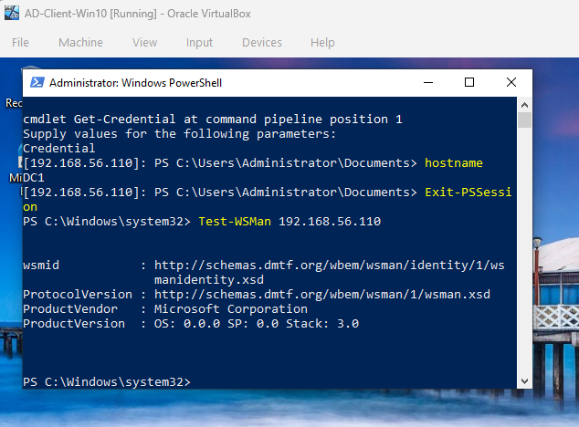

## A. Configured and validated WinRM connectivity between the Windows 10 workstation and Windows Server to support remote administration of the Domain Controller.

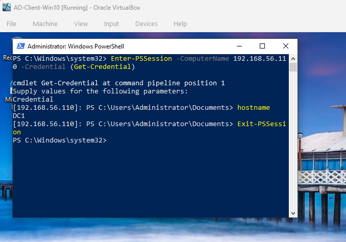

## B. Established a remote PowerShell session and configured the Windows Server hostname as `DC1`.

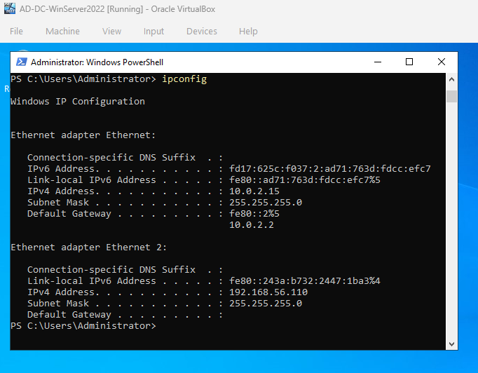

## C. Assigned `DC1` the persistent Host-Only IP address `192.168.56.110` to provide reliable communication for domain services.

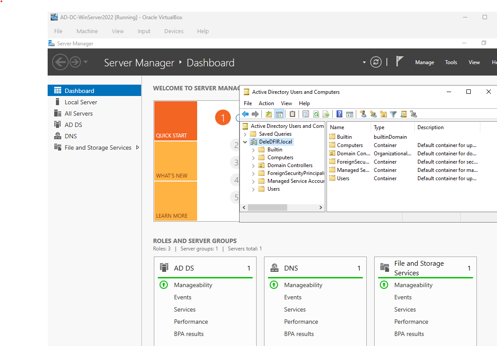

## D. Installed Active Directory Domain Services and promoted `DC1` to the Domain Controller for the `DeleDFIR.local` forest.

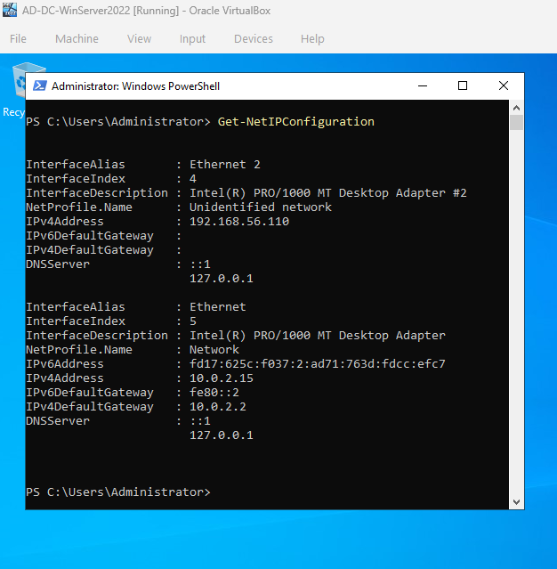

## E. Verified the Domain Controller network interfaces and confirmed DNS was configured to point to `DC1`.

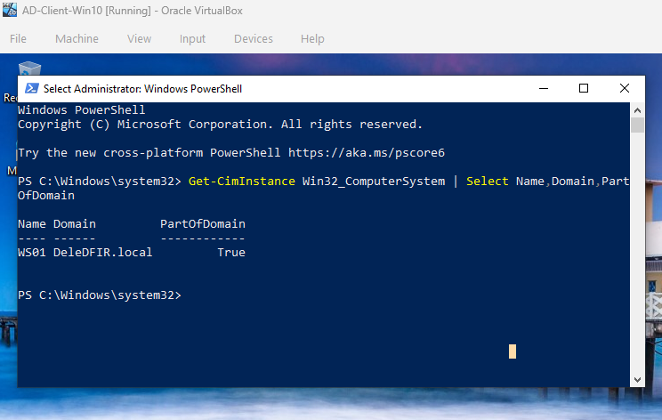

## F. Configured `WS01` to use the Domain Controller for DNS and successfully joined it to the `DeleDFIR.local` domain.

## Challenges & Troubleshooting

WS01 initially could not discover the domain because its DNS configuration was incorrect and the cloned workstation remained associated with the unavailable `DFIR.local` domain. The issue was identified through network and domain configuration checks, after which WS01 was moved to `WORKGROUP`, configured to use `192.168.56.110` for DNS, and successfully joined to `DeleDFIR.local`.

## Summary

**Investigation Findings:** Configuration evidence confirmed successful `DC1` promotion, DNS configuration, network connectivity, and `WS01` reporting `PartOfDomain: True` for `DeleDFIR.local`.

**Security Decision:** A dedicated Host-Only network and static Domain Controller IP were used to provide predictable and controlled communication between the Active Directory systems.

**Validation:** WinRM connectivity, hostname configuration, static IP configuration, AD DS deployment, DNS configuration, and the final domain-join status were validated through PowerShell and Windows configuration evidence.

## SOC Impact

This provides a realistic Windows identity environment where SOC teams can monitor and investigate authentication, account, endpoint, DNS, and Active Directory security events.

---

# Part 2 — Automating Domain Users

## Objective
Automate Active Directory user and group provisioning to reduce manual account-creation errors and provide a repeatable, controlled method for building domain-user environments.

## Scope & Assumptions
This lab simulates a Windows domain environment using `DC1` as the Domain Controller and `WS01` as the Windows 10 workstation, with PowerShell and JSON used for repeatable account provisioning and authentication testing.

## Skills
- Active Directory Administration | PowerShell Automation | Identity & Access Management | User and Group Provisioning | Domain Authentication | Troubleshooting & Incident Analysis | Security Validation | Windows Administration

## Tools
- **Windows Server 2022 / Active Directory** — Domain Controller and identity management.
- **Windows 10 / WS01** — Domain workstation used for authentication testing.
- **PowerShell** — Automated user/group creation, remote administration, and validation.
- **VS Code** — Developed and maintained the PowerShell automation script and JSON configuration.
- **JSON** — Structured configuration for repeatable user and group provisioning.
- **WinRM** — Transferred automation files and enabled remote administration of `DC1`.
- **Active Directory Users and Computers** — Verified provisioned users and groups.

## Steps

[View PowerShell AD Automation Files](./PowerShell-AD-Automation/)

### 01. JSON-Based AD Configuration
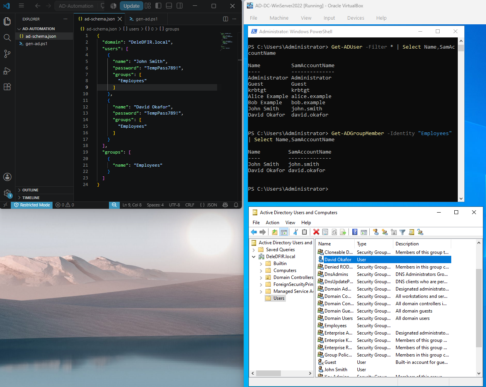

Defined users, groups, and memberships in a JSON schema and used PowerShell automation to provision the configured Active Directory environment consistently.

### 02. Automated User & Group Creation
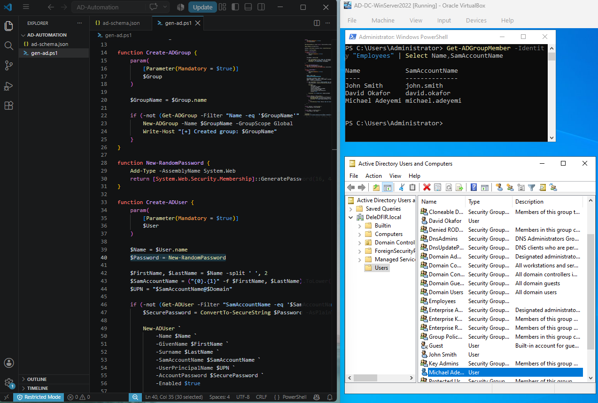

Implemented `gen-ad.ps1` to create enabled domain users, generate secure random passwords, create groups, validate group existence, and assign users to their configured groups.

### 03. Domain Authentication & Validation
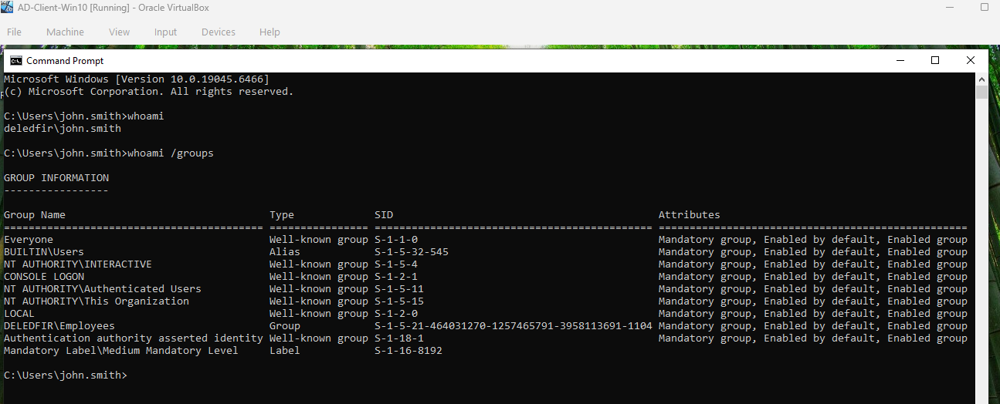

Rejoined `WS01` to `DeleDFIR.local` and validated successful domain authentication and `Employees` group membership using `whoami` and `whoami /groups`.

## Summary

**Investigation Findings:** Evidence from PowerShell execution, Active Directory Users and Computers, and workstation authentication confirmed that the JSON-driven automation successfully created enabled domain users and assigned them to the `Employees` group.

**Security Decision:** PowerShell automation with structured JSON configuration and secure random password generation was selected to reduce manual provisioning errors and avoid the intentionally weak credentials used in the reference vulnerable workflow; a known password was temporarily set for John Smith solely to validate domain authentication.

**Validation:** The workflow was validated through successful JSON parsing and WinRM file transfer, creation of the `Employees` group and configured AD users, confirmation that Michael Adeyemi was enabled and assigned to `Employees`, and successful `john.smith` authentication on `WS01` verified with `whoami` and `whoami /groups`.

## Impact

Repeatable identity provisioning and validation reduces manual administrative effort, improves consistency, and gives SOC teams clearer evidence of domain-account configuration during investigations.

---

# PART 3 — PowerShell: Random Users & Weak Passwords

## Objective
Automate randomized Active Directory user and group provisioning to create a controlled security-testing environment for identifying authentication, password-policy, and account-management risks.

## Scope & Assumptions
This project is a local VirtualBox Active Directory lab using Windows Server 2022 (`DC1`), Windows 10 (`WS01`), and the `DeleDFIR.local` domain to simulate enterprise identity and security operations.

## Skills
- PowerShell automation | Active Directory administration | Identity and access management | Password-policy analysis | Authentication troubleshooting | Group Policy validation | Security testing and evidence collection | Incident investigation and troubleshooting

## Tools
- **Visual Studio Code** — Used to create and edit the PowerShell automation scripts, JSON schema, and randomized data files.
- **PowerShell** — Automated randomized user/group generation, provisioning, validation, and troubleshooting.
- **Active Directory Domain Services** — Hosted and managed the simulated enterprise identities, groups, and authentication.
- **Windows Server 2022** — Provided the domain controller and security-policy environment.
- **Windows 10** — Served as the domain workstation for authentication and Group Policy validation.
- **WinRM / PowerShell Remoting** — Supported secure administration and deployment between the lab systems.

## Steps

[View PowerShell AD Automation Files](./PowerShell-AD-Automation/)

### 01 — Random Active Directory Environment Generation

Created a PowerShell-based generator that produces randomized users, groups, names, and passwords, providing repeatable identity data for controlled security testing.

### 02 — Random Data & Group Selection

Implemented randomized and unique group selection so generated users receive varied organizational memberships for realistic access-control testing.

### 03 — Random User Generation & JSON Structure
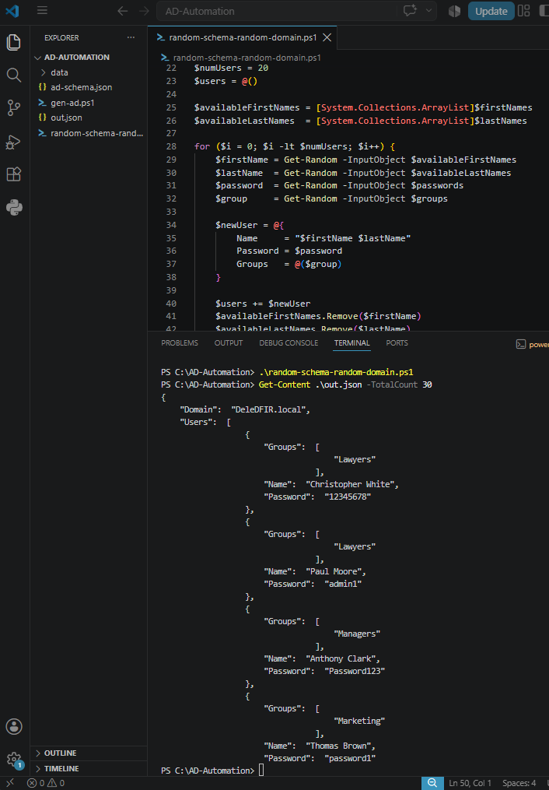

Configured the generator to create 20 randomized users with unique names, passwords, and group assignments and serialize the environment into a reusable JSON structure.

### 04 — Random Domain Deployment & Troubleshooting
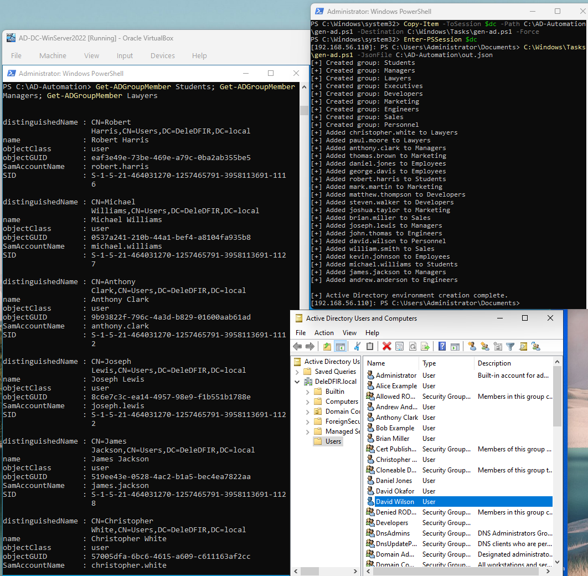

Deployed the generated environment to `DC1`, resolved group-handling and PowerShell Remoting issues, and verified the generated groups, users, and memberships in Active Directory.

### 05 — Password Policy & Authentication Testing
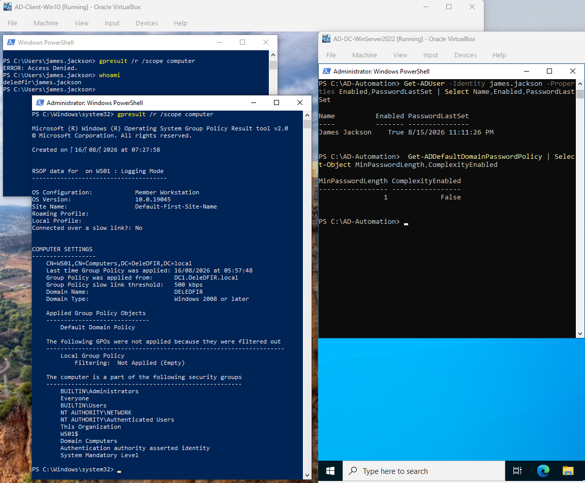

Adjusted the domain password-policy testing workflow, validated authentication from `WS01`, and confirmed that the Default Domain Policy was being applied.

### 06 — Random Domain Validation & Authentication
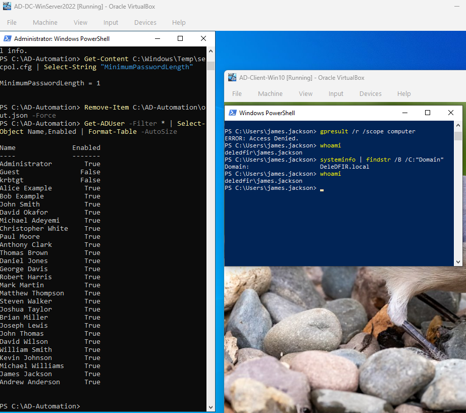

Validated the randomized domain environment across `DC1` and `WS01`, confirming domain membership, user authentication, account creation, and password-policy configuration.

## Challenges & Troubleshooting
Initial JSON output contained metadata instead of strings; corrected data‑loading logic to ensure clean schema. Encountered WinRM/SMB transfer failures and group‑creation errors, resolved by adjusting remoting workflow and fixing group‑handling logic.
Password-policy authentication failed because generated passwords did not meet the domain requirements; I confirmed the account state with AD queries, then reset the test account to a compliant password and successfully authenticated from WS01.

## Summary

### Investigation Findings
Evidence from Active Directory queries, `whoami`, `gpresult`, and `secpol.cfg` confirmed 20 generated users, successful domain authentication, application of the Default Domain Policy, and a configured minimum password length of 1 character.

### Security Decision
The environment used controlled weak-password testing and randomized identities to expose authentication and account-provisioning weaknesses without affecting a production environment.

### Validation
The implementation was validated by confirming generated accounts and group memberships in Active Directory, successful `WS01` domain authentication, Default Domain Policy application, and `MinimumPasswordLength = 1`, with temporary `out.json` credentials removed after testing.

## SOC Impact
The project provides a repeatable identity-testing environment that helps SOC teams reproduce authentication and account-management scenarios, investigate identity-related alerts, and validate security controls more efficiently.

---

# Part 4 — Building a Reversible Active Directory Lab

## Objective

Build a deliberately vulnerable and repeatable Active Directory lab to support controlled security testing while demonstrating the ability to create, validate, revert, and rebuild domain security configurations.

## Scope & Assumptions

A simulated `DeleDFIR.local` Active Directory environment consisting of Windows Server 2022 DC1, Windows 10 WS01, and a management workstation, with intentionally weak security settings used only for controlled lab exercises.

## Skills

- Active Directory administration and user/group management | Windows Server and workstation administration | PowerShell automation | Security policy configuration and validation | Domain join and remote administration | Authentication and domain-trust validation - Troubleshooting and evidence-based investigation - Reversible configuration and clean-slate environment management

## Tools

- **Visual Studio Code** — Edited and maintained the PowerShell automation scripts and JSON configuration files.
- **Windows Server 2022** — Domain Controller and Active Directory/DNS services
- **Windows 10 Pro** — Domain workstation and authentication testing
- **PowerShell / Active Directory Module** — Administration, validation, and automation
- **VirtualBox** — Isolated lab virtualization and recovery snapshots
- **Git / GitHub** — Version control and evidence tracking
- **secedit** — Security policy export and inspection
- **VirtualBox Shared Folders / PowerShell Remoting** — Lab file transfer and remote administration

## Steps

### 01 — Domain Controller Preparation

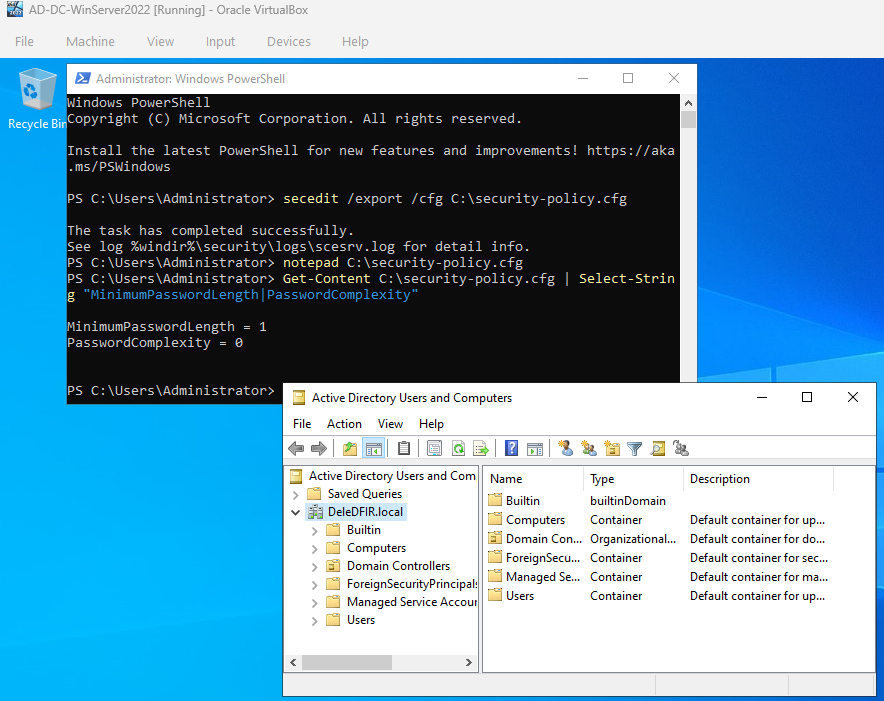

Configured and validated the `DeleDFIR.local` Domain Controller and intentionally weak password policy to establish the controlled environment required for subsequent Active Directory security testing.

### 02 — Password Policy & AD Automation

[View PowerShell AD Automation Files](./PowerShell-AD-Automation/)

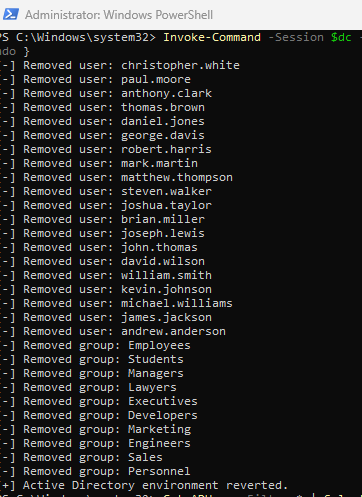

Executed the AD automation `-Undo` workflow to remove generated Active Directory users and groups, demonstrating that the vulnerable environment could be safely reversed.

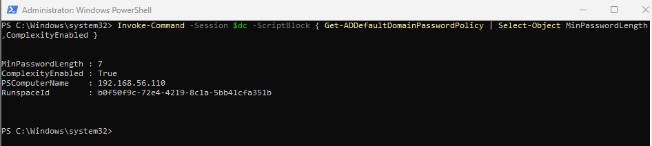

Verified that the undo workflow restored the domain password policy to the stronger baseline of a 7-character minimum with password complexity enabled.

### 03 — Workstation Domain Join & Remote Administration

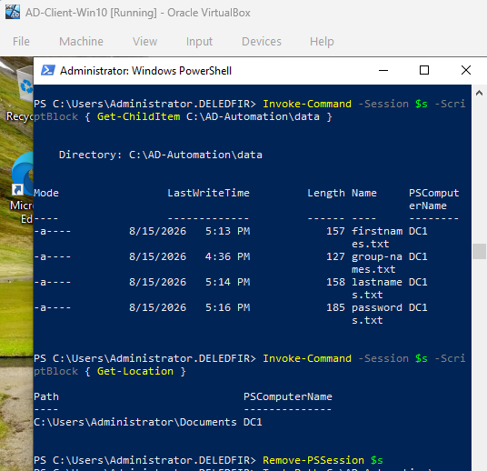

Removed and rejoined WS01 to `DeleDFIR.local`, established PowerShell Remoting to DC1, and transferred the automation files for centralized Active Directory management.

### 04 — Active Directory User Validation

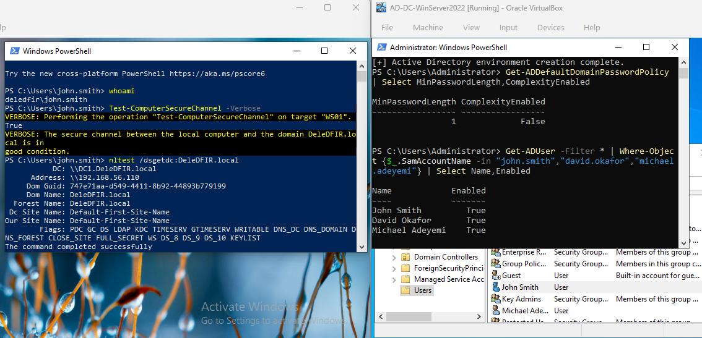

Generated domain users with intentionally weak credentials and validated successful domain authentication, secure-channel health, and Domain Controller discovery from WS01.

### 05 — Reversible Environment Management

Validated the automation lifecycle by removing generated users and groups, restoring the stronger password policy, and confirming the environment could be recreated for repeatable security testing.

## Challenges & Troubleshooting

After the AD automation `-Undo` workflow removed generated accounts, WS01 remained domain-joined and the previously used domain account was unavailable, so access was recovered through the existing local Administrator account without rebuilding the workstation.  
Host-to-WS01 SMB transfer also failed after the domain rejoin, so VirtualBox Shared Folders were used to transfer the automation data before PowerShell Remoting was used to copy it to DC1.

## Summary

**Investigation Findings:** Evidence confirmed an intentionally weak password policy (`MinimumPasswordLength = 1`, `PasswordComplexity = 0`), successful domain-user authentication, healthy WS01 secure-channel status, and successful discovery of DC1.

**Security Decision:** A reversible PowerShell automation workflow was used to make the vulnerable AD state repeatable while allowing generated security objects and policy changes to be safely removed and restored.

**Validation:** The environment successfully created three configured domain users, assigned them to the `Employees` security group, authenticated a generated user from WS01, validated the domain connection, and restored the baseline password policy through the automation workflow.

## SOC Impact

A repeatable vulnerable AD environment allows SOC teams to safely reproduce authentication and identity-related attack conditions, validate detection and response workflows, and reset the environment quickly for repeated investigations.

---

# Part 5 — Brute-Forcing Domain Passwords

### Objective
Assess the resilience of a controlled Active Directory environment against credential attacks and identify password-policy weaknesses that could increase account-compromise risk.

### Scope & Assumptions
Testing was performed in the isolated `DeleDFIR.local` VirtualBox lab using Kali Linux, DC1, and WS01, with all credential-testing activities limited to the intentionally vulnerable environment.

### Skills
- Active Directory security assessment | Credential testing and password-policy analysis | SMB and LDAP enumeration | Network/service enumeration | Evidence collection and troubleshooting | Security validation and risk assessment

### Tools
- **Kali Linux:** Attack workstation for controlled credential-testing and reconnaissance.
- **Windows Server 2022 (DC1):** Domain Controller hosting the `DeleDFIR.local` Active Directory environment and target for credential validation and enumeration.
- **Windows 10 (WS01):** Domain-joined workstation used for host and network validation.
- **NetExec:** SMB/LDAP authentication, credential validation, and Active Directory enumeration.
- **Nmap:** Network and service discovery against lab systems.
- **VirtualBox:** Isolated lab infrastructure and Host-Only networking.

### Steps

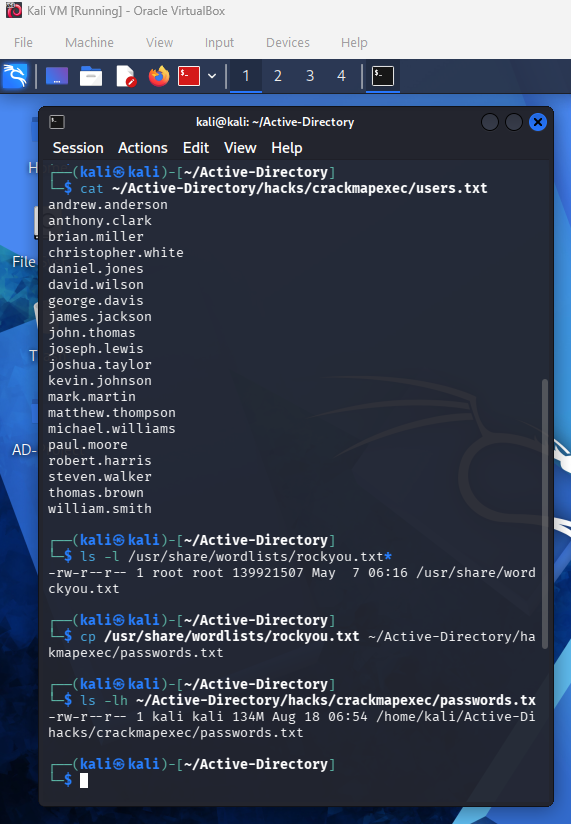

Prepared domain usernames and a password wordlist in Kali for controlled credential testing against the Active Directory environment.

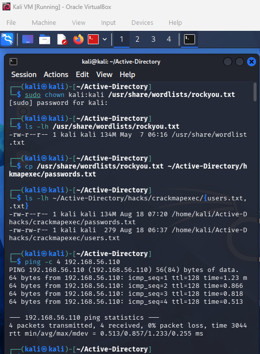

Validated Host-Only connectivity between Kali and DC1 before conducting credential-testing activities.

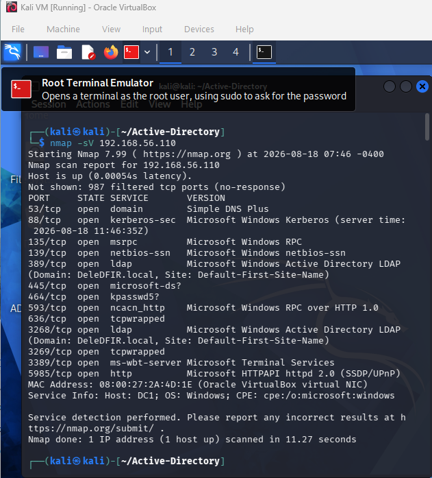

Enumerated DC1 services with Nmap to identify exposed Active Directory services relevant to the security assessment.

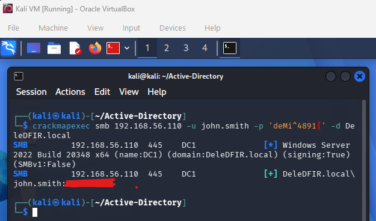

Validated SMB connectivity and authenticated to DC1 with a domain account, confirming the credential-testing workflow was functioning.

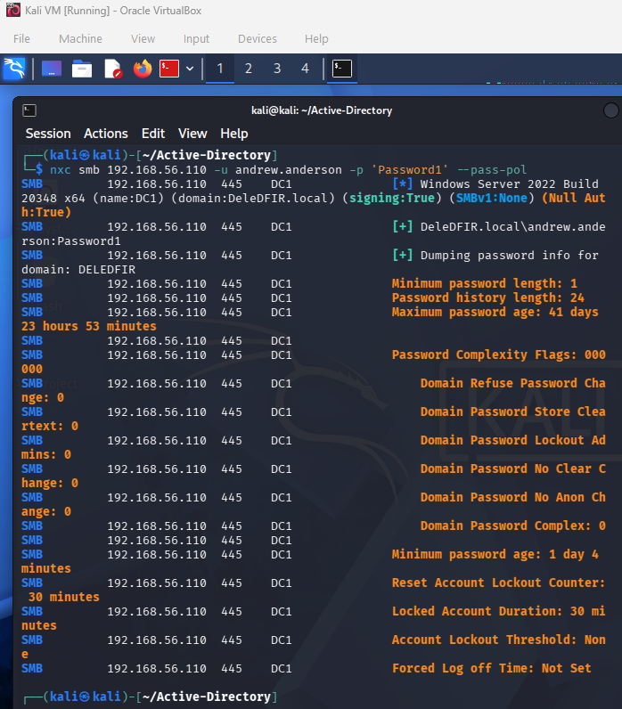

Used the recovered low-privileged credential to validate SMB access and confirm the intentionally weak domain password policy.

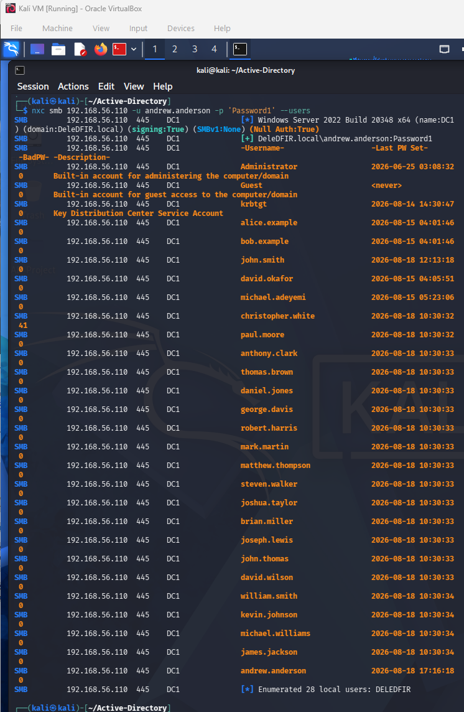

Used the valid low-privileged credential to enumerate 28 domain user accounts through SMB.

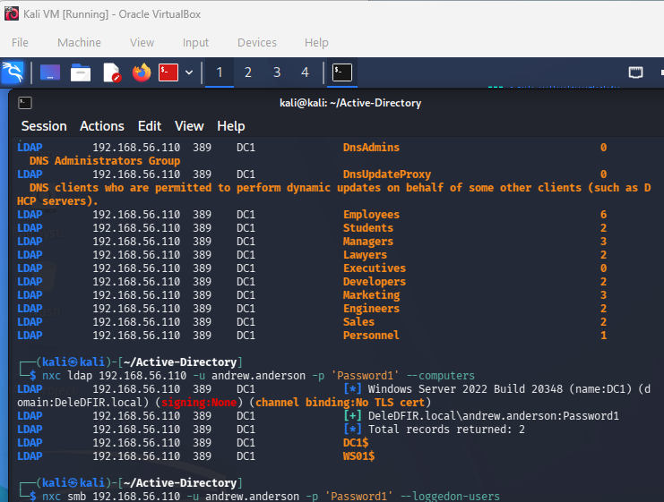

Used LDAP enumeration to identify custom Active Directory groups and the two domain computers, `DC1$` and `WS01$`.

### Challenges & Troubleshooting
Initial credential testing produced `STATUS_LOGON_FAILURE` because `out.json` contained stale credentials from an earlier AD state; reviewing `net user /domain` and PowerShell history identified that `andrew.anderson` had been manually reset.  
The corrected credential successfully authenticated through NetExec, allowing password-policy enumeration and subsequent credentialed Active Directory reconnaissance.

### Summary

**Investigation Findings:** Evidence from NetExec, Nmap, and Active Directory enumeration confirmed successful low-privileged SMB/LDAP access, 28 enumerated users, two domain computers, accessible `NETLOGON`/`SYSVOL` shares, and a password policy allowing one-character passwords with complexity disabled.

**Security Decision:** SMB and LDAP were selected for credential validation and directory reconnaissance because they provided the required authentication and Active Directory visibility while remaining appropriate for the isolated lab environment.

**Validation:** NetExec confirmed successful authentication and retrieved the configured policy values of `Minimum password length: 1` and `Domain Password Complex: 0`, demonstrating that the lab environment remained intentionally vulnerable to weak-credential risk.

### SOC Impact
The exercise demonstrates how defenders can validate credential exposure and weak Active Directory controls, producing evidence that can support detection engineering, account-risk assessment, and remediation decisions.

---

## Part 6 — BloodHound Domain Enumeration

- **Objective:** Map Active Directory identities, privileges, and relationships to identify potential privilege paths and improve understanding of domain security risks.

- **Scope & Assumptions:** A controlled `DeleDFIR.local` Active Directory lab was enumerated remotely from a Kali Linux attacker workstation using a verified low-privileged domain account.

- **Skills:** Active Directory enumeration | identity and privilege analysis | attack-path analysis | security reconnaissance | troubleshooting | evidence-based investigation

- **Tools:** Kali Linux | BloodHound Community Edition (CE) | `bloodhound-python` | Neo4j | PostgreSQL | Active Directory | PowerShell | Cypher queries

- **Steps:**
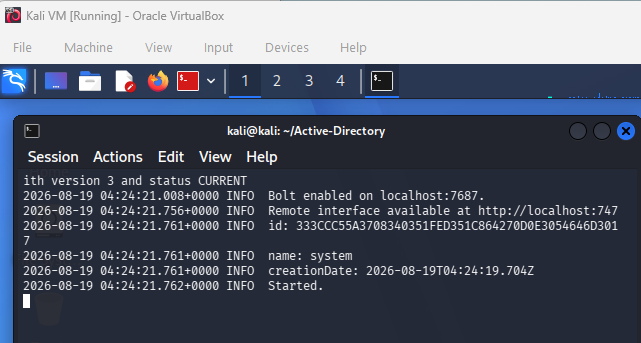
  Configured the BloodHound environment and Neo4j backend, then used `bloodhound-python` with the verified domain credential to remotely collect Active Directory users, groups, computers, domains, GPOs, OUs, and containers for relationship analysis.

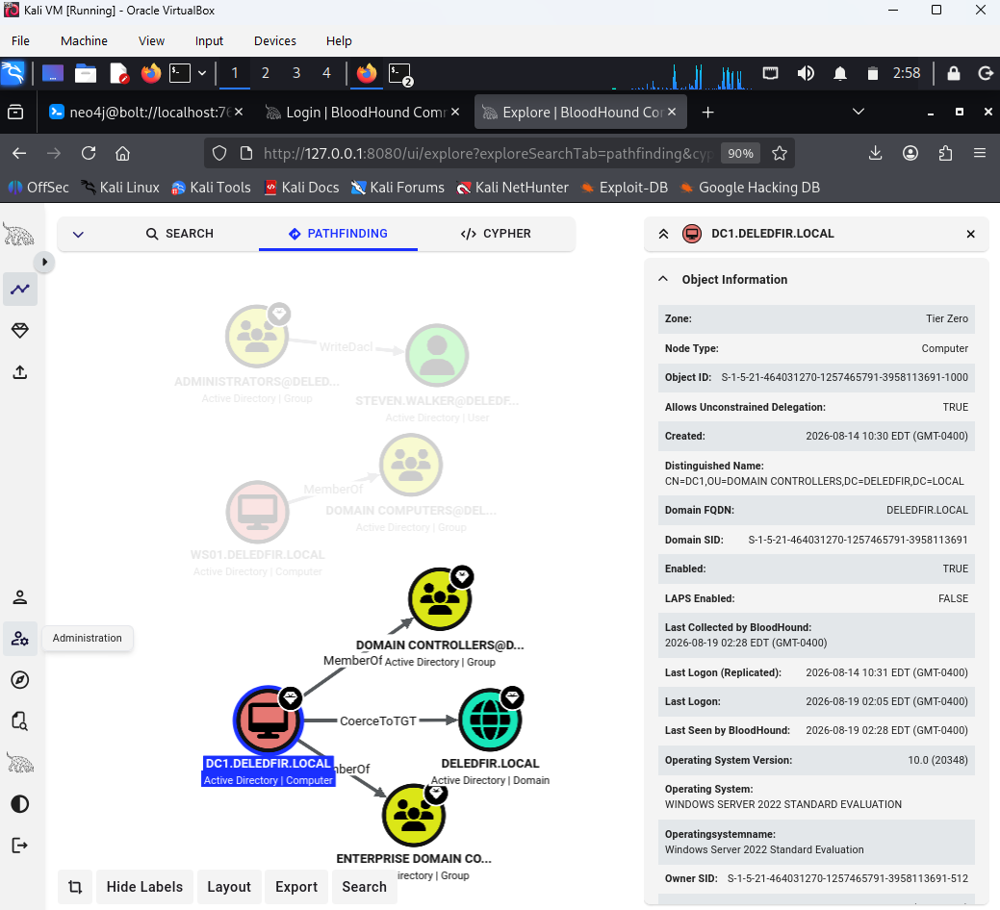
  Imported the collected data into BloodHound CE and analyzed domain relationships, group memberships, privileged accounts, and potential attack paths within the lab environment.

- **Challenges & Troubleshooting:** 
BloodHound initially encountered Kerberos, DNS, and Global Catalog resolution issues when attempting to reach `DC1`, evidenced by collector connection errors and hostname-resolution failures. Configured Kali to resolve the domain through the Domain Controller and validated hostname resolution, after which BloodHound successfully collected and exported the Active Directory data.

- **Summary:**
  - **Investigation Findings:** BloodHound successfully collected evidence covering 2 computers, 29 users, 62 groups, 2 GPOs, 1 OU, and 19 containers, enabling analysis of Active Directory relationships and privilege paths.

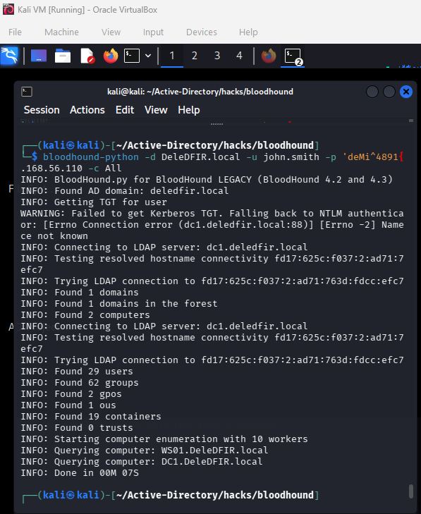

  - **Security Decision:** BloodHound was selected because relationship-based AD analysis provides visibility into how low-privileged accounts, groups, computers, and privileged resources are connected.

  - **Validation:** Successful JSON collection, import into BloodHound CE, and visualization of `DeleDFIR.local` relationships confirmed that the enumeration workflow was functioning correctly.

- **SOC Impact**
 BloodHound gives SOC and security teams a relationship-based view of Active Directory that can accelerate investigation of privilege exposure, account relationships, and potential attack paths.

 ---

 # PART 7 — PowerShell: Automating Random Local Administrators

## Objective
Automate the generation and assignment of controlled local administrator accounts in an Active Directory environment to support repeatable privilege-management and security testing.

## Scope & Assumptions
This project was implemented as a controlled Active Directory lab using Windows Server 2022, PowerShell, and generated test accounts, with administrator assignments limited to the Domain Controller.

## Skills
- PowerShell automation | Active Directory administration | Privileged account management | Identity and access management | Security testing | Troubleshooting and validation | Evidence-based investigation

## Tools
- **PowerShell** — automated user, group, and local administrator generation.
- **Active Directory** — provided the identity and privilege-management environment.
- **Windows Server 2022** — hosted the Domain Controller and local Administrators group.
- **PowerShell Remoting** — enabled remote administration and file transfer between lab systems.
- **VirtualBox** — provided the isolated lab environment.

## Steps

[View PowerShell AD Automation – Part 7](./PowerShell-AD-Auto-07/)

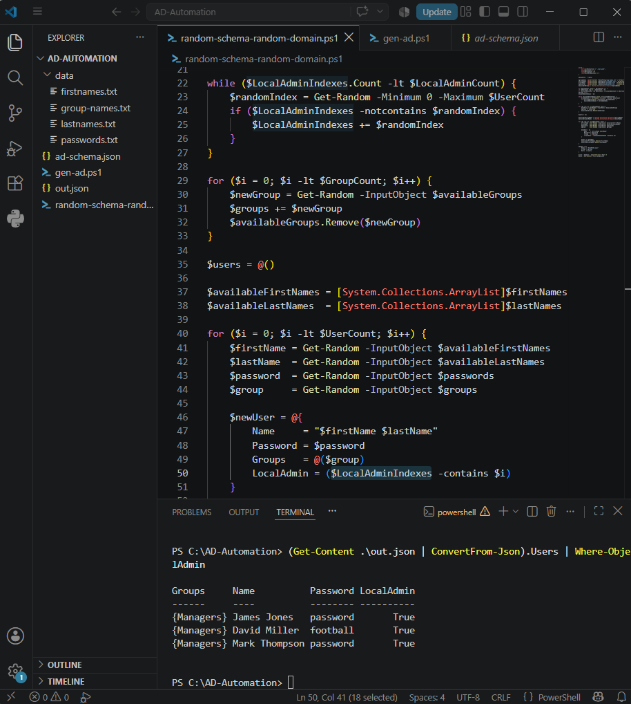

The PowerShell generator was modified to create a configurable test environment and randomly designate exactly three unique generated users as local administrators.

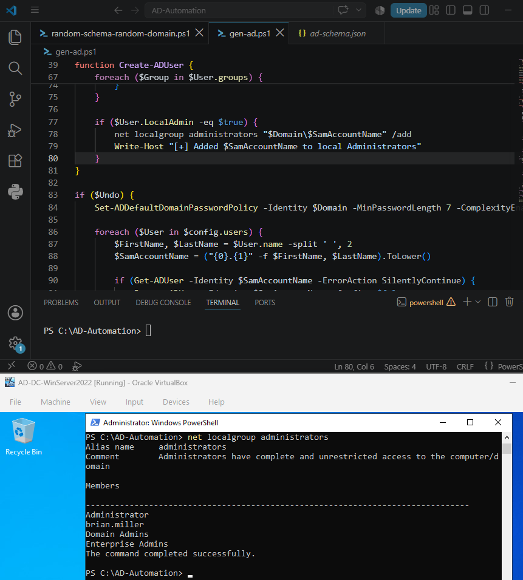

The AD generation script reads each user's `LocalAdmin` property and assigns designated domain accounts to the local `Administrators` group.

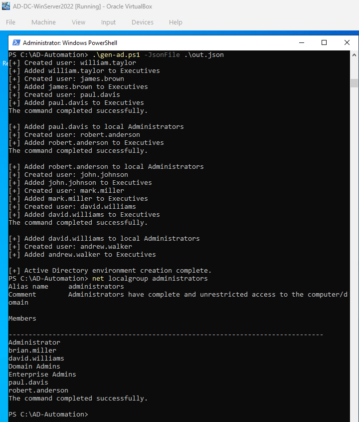

The rebuilt environment was validated with eight users and three designated local administrators, with `net localgroup administrators` confirming `paul.davis`, `robert.anderson`, and `david.williams`.

## Challenges & Troubleshooting
The initial generated JSON contained 20 users and no `LocalAdmin` properties because DC1 was using an older 1,597-byte copy of the generator, which was identified by inspecting the script contents and file metadata.  
The updated 2,123-byte script was copied through the VirtualBox shared-folder workflow to DC1, after which the JSON correctly contained eight users and three `LocalAdmin: true` entries and the AD generator successfully assigned all three accounts.

## Summary

**Investigation Findings:** Evidence from the generated JSON and `net localgroup administrators` confirmed that exactly eight test users were generated and three designated accounts received local administrator privileges.

**Security Decision:** A configurable and randomized administrator-assignment approach was selected to make privileged-account scenarios repeatable while avoiding hard-coded administrator identities.

**Validation:** The control was validated by confirming three `LocalAdmin: true` entries in the JSON and three corresponding generated users in DC1's local `Administrators` group, with continued monitoring recommended through Windows security-event and privileged-account activity.

## SOC Impact

Automating repeatable privileged-account scenarios gives SOC teams a consistent way to generate, test, and validate identity-based detections while reducing manual configuration effort.

---

# PART 8 — Joiner, Mover, Leaver (JML) & Simulated Access Review

## Objective

Automate employee lifecycle access management to reduce the risk of inappropriate, excessive, or retained Active Directory access when employees join, change roles, or leave.

## Scope & Assumptions

This project is a simulated IAM workflow built on the DeleDFIR.local Active Directory homelab, using HR-style JSON records as the source of truth for Joiner, Mover, and Leaver events.

## Skills

- **Identity & Access Management (IAM)**
- **Joiner-Mover-Leaver (JML)** lifecycle management
- **Active Directory** administration
- **Access provisioning** and deprovisioning
- **Access review** and validation
- **PowerShell automation**
- **JSON identity data** handling
- **Audit logging** and evidence collection
- **Security operations** and access-control analysis

## Tools

- **Active Directory** — Provisioned, modified, disabled, and validated user identities and group-based access.
- **PowerShell** — Automated JML provisioning, access revocation, validation, and audit logging.
- **JSON** — Used as the simulated HR/source identity record.
- **Windows Server / WinRM** — Executed and validated the workflow on the domain controller.
- **GitHub** — Preserved the automation and portfolio evidence.

## Steps

[View PowerShell JML/IAM Automation – Part 8](./PowerShell-JML-IAM-Automation/)

### A. Joiner — HR Record to AD Access

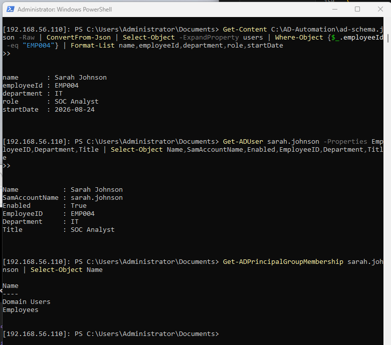

Created a simulated HR employee record for Sarah Johnson, provisioned the corresponding AD account with employee attributes, and validated baseline `Employees` group access.

### B. Leaver — Automated Access Revocation

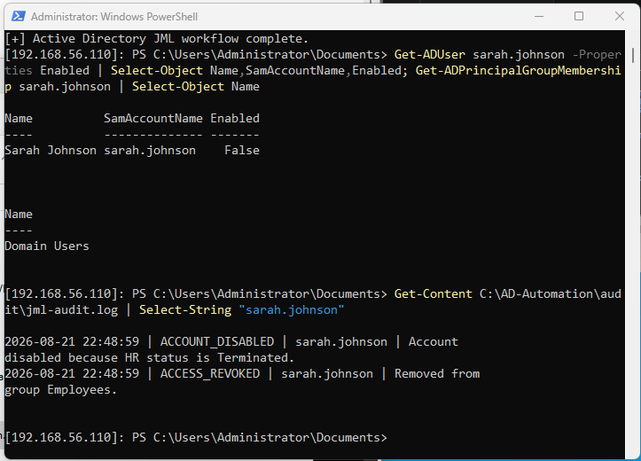

Changed Sarah Johnson’s HR status to `Terminated`, detected the termination during synchronization, disabled her AD account, removed `Employees` access, and recorded the remediation in an audit log.

### C. Mover — Role Change & Access Review

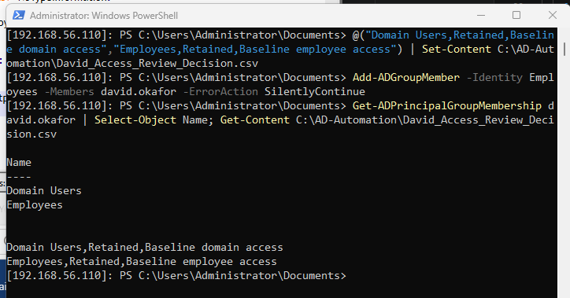

Changed David Okafor’s department and role, exported his existing access for review, documented the retention decision, and validated his final AD memberships.

## Challenges & Troubleshooting

The existing AD automation did not initially support HR lifecycle attributes, termination handling, or access-review decisions, so the PowerShell workflow was extended without removing the existing provisioning capability.  
The workflow was validated against the HR JSON source and Active Directory outputs, confirming that the Leaver path disabled the terminated account and removed `Employees` access while the Mover review preserved approved baseline access.

## Summary

**Investigation Findings:** Evidence from the HR source records, Active Directory membership checks, and JML audit log confirmed that lifecycle changes could be mapped to specific identity provisioning, deprovisioning, and access-review outcomes.

**Security Decision:** A JSON-driven PowerShell workflow was selected to provide repeatable lifecycle enforcement while keeping identity changes, access decisions, and remediation actions auditable.

**Validation:** Three lifecycle scenarios were validated—one Joiner provisioned with baseline access, one Leaver disabled with access revoked and audited, and one Mover reviewed with approved access retained.

## Operational Impact

Automating JML and access-review actions reduces manual identity-management effort, improves consistency of access decisions, and gives SOC/IAM teams auditable evidence for investigating inappropriate or outdated access.

---

# PART 9 — Compromising Windows Hosts w/ Impacket

## Objective
Demonstrate how compromised administrative credentials could be used to remotely execute commands on Windows hosts and assess the resulting security exposure.

## Scope & Assumptions
This lab simulation used Kali Linux against the `DeleDFIR.local` Active Directory Host-Only network to assess remote administration and execution paths on DC1 and WS01.

## Skills
- Windows/Active Directory Security | Network & SMB Enumeration | Credential Validation | Remote Execution Analysis | Privilege Verification | Endpoint Security Analysis | Attack Path Analysis | Security Investigation & Documentation

## Tools
- **NetExec (NXC):** Enumerated Windows hosts, validated credentials, and identified writable administrative shares.
- **Nmap:** Discovered reachable systems and mapped IP addresses.
- **Impacket:** Tested PSExec, SMBExec, and WMIExec remote execution techniques.
- **BloodHound:** Assessed Active Directory relationships and attack-path exposure.
- **Microsoft Defender:** Provided endpoint detection during the WMIExec execution attempt.

## Steps

### 1. Windows Host & SMB Enumeration

NetExec and Nmap identified WS01 (`192.168.56.102`) and confirmed SMB/445 exposure, while authenticated enumeration verified administrative access and writable `ADMIN$` and `C$` shares.

### 2. PSExec Remote Execution
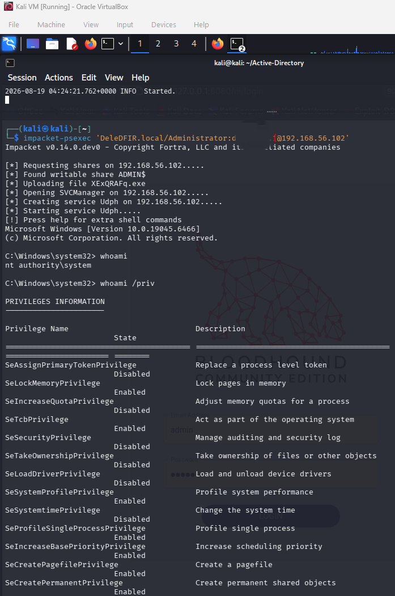

Impacket PSExec used the confirmed administrative credentials to access WS01 through `ADMIN$`, create a temporary service, and obtain an `NT AUTHORITY\SYSTEM` shell.

### 3. SMBExec Remote Execution
SMBExec successfully established a semi-interactive shell on WS01 and confirmed execution as `NT AUTHORITY\SYSTEM`, demonstrating a second viable SMB-based execution path.

### 4. WMIExec & Endpoint Detection
WMIExec was tested against WS01 and DC1 but did not establish a shell, while Microsoft Defender detected the remote-execution payload, demonstrating endpoint protection against the attempted technique.

### 5. Privilege & Attack-Path Validation
`whoami /priv` confirmed extensive SYSTEM privileges, while BloodHound marked the compromised Administrator account as Owned and showed zero outbound object-control relationships for WS01.

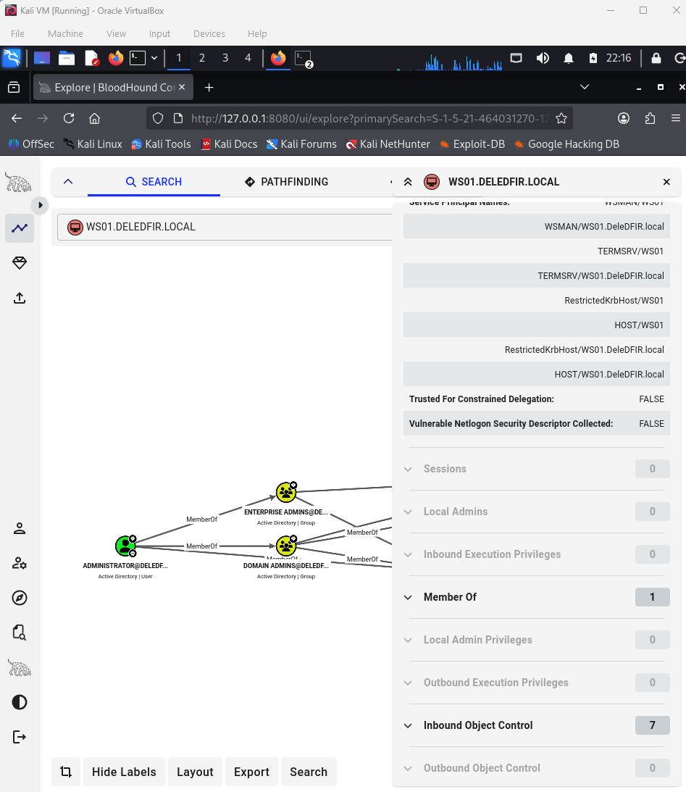

## Challenges & Troubleshooting
WS01 initially returned `STATUS_NO_LOGON_SERVERS` because its DNS configuration used public DNS instead of the domain controller, which was identified through `ipconfig /all` and `nslookup` and resolved by configuring DNS to DC1 (`192.168.56.110`).  
WMIExec authenticated but failed to establish a shell and triggered Microsoft Defender, so the failure and detection were documented rather than disabling the security control.

## Summary

**Investigation Findings:** Evidence from Nmap, NetExec, Impacket, `whoami /priv`, BloodHound, and Microsoft Defender showed that WS01 exposed SMB/445 with writable `ADMIN$`/`C$` shares, allowing confirmed administrative credentials to achieve SYSTEM-level execution through PSExec and SMBExec.

**Security Decision:** SMB-based execution paths were prioritized because the exposed administrative shares and confirmed local-admin access represented the clearest demonstrated route to host compromise.

**Validation:** PSExec and SMBExec both achieved `NT AUTHORITY\SYSTEM`, WMIExec failed and generated a Defender detection, and BloodHound reported zero outbound object-control relationships for WS01.

## Operational Impact

Helps SOC analysts quickly identify and validate exploitable administrative access and lateral‑movement paths before attackers can abuse them, improving triage speed and reducing overall security risk.

---

# Part 10 — Active Directory Credential Exposure & Remediation

## Objective
Identify and remediate the risk of exposed passwords stored in readable Active Directory user attributes.

## Scope & Assumptions
Demonstrated within a simulated AD lab environment (DeleDFIR.local) to validate credential exposure, investigation, and remediation workflows.

## Skills
- Active Directory security and user management | Credential exposure analysis | Identity and access management | SOC investigation and evidence collection | BloodHound enumeration and relationship analysis | Windows PowerShell administration | SMB authentication validation | Security remediation and verification | Technical documentation

## Tools
- **Active Directory / Windows Server** — Configured vulnerable user attributes and applied remediation.
- **PowerShell** — Automated account provisioning, credential exposure setup, password reset, and remediation.
- **Kali Linux** — Conducted credential discovery and validation.
- **BloodHound** — Enumerated AD users, groups, computers, and relationships.
- **BloodHound Python** — Collected domain data for investigation.
- **SMBClient** — Verified exposed credentials against the domain controller.

## Steps

[View PowerShell AD Automation – Part 11](./PowerShell-AD-Auto-10-11/)

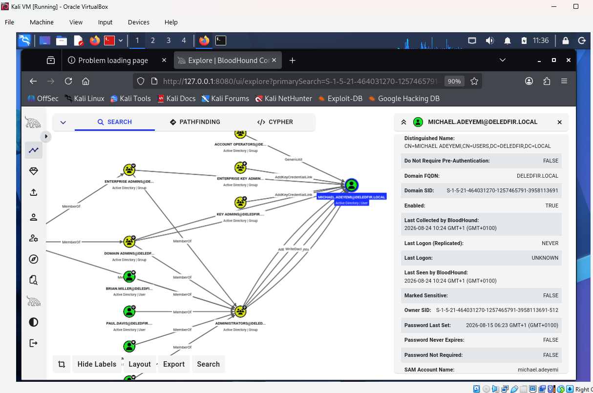

BloodHound inspection — Collected AD user object data and identified properties/relationships relevant to credential exposure.

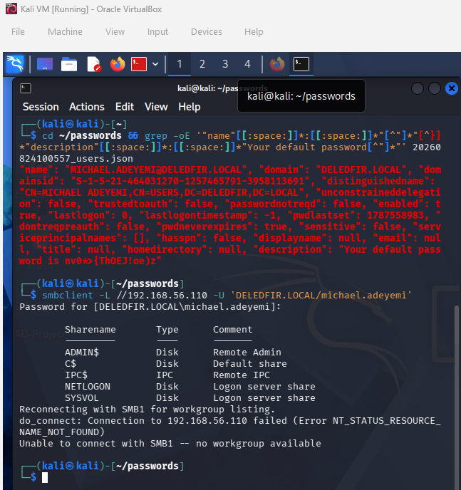

Searched users.json for exposed descriptions and confirmed the discovered credential via SMB authentication.

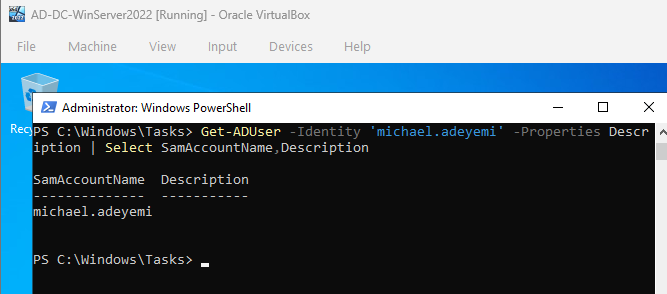

Reset the compromised account password and cleared the exposed AD description to remove the credential.

## Challenges & Troubleshooting
AD automation generated random passwords when accounts were recreated, invalidating known credentials; resolved by verifying account state and retrieving the current lab credential before rerunning BloodHound.

BloodHound did not display the exposed description directly in the user panel, so users.json was searched to identify the exposed credential, which was then successfully validated through SMB authentication within the lab.

## Summary

**Investigation Findings:** BloodHound, users.json, and SMB authentication confirmed that Michael Adeyemi’s AD description field exposed a usable password that authenticated against DC1.

**Security Decision:** The exposed credential was reset and the vulnerable description attribute removed.

**Validation:** Get-ADUser verified the description field was cleared after remediation.

## Operational Impact

Reduces organizational breach risk by identifying and eliminating exposed Active Directory credentials before attackers can exploit them for unauthorized access, lateral movement, or data compromise.

---

## Part 11: NTLM vs Kerberos — Kerberoasting

### Objective
Show how a low‑privileged domain user can abuse an exposed Kerberos SPN to request a service ticket and enable offline password cracking, underscoring the risk of weak service‑account credentials.

### Scope & Assumptions
Controlled DeleDFIR.local Active Directory lab on Windows Server 2022 (DC1), WS01, and Kali Linux in a VirtualBox Host-Only network, with deliberately weak credentials used solely for security testing.

### Skills
Active Directory Security | Identity & Access Management | Kerberos Authentication | Kerberoasting | Credential Attack Analysis | PowerShell Automation | Security Validation | Incident Analysis

### Tools
1. **PowerShell** → Automated AD user creation, SPN assignment, and audit logging to simulate service accounts.
2. **Active Directory** → Provided the domain environment where SPNs could be exposed and abused.
3. **Kali Linux** → Served as the attacker machine to run Kerberoasting tools.
4. **Impacket GetUserSPNs** → Queried AD for service accounts with SPNs and requested Kerberos tickets.
5. **Hashcat** → Performed offline password cracking against the captured Kerberos service tickets.
6. **VirtualBox** → Hosted the isolated lab network, ensuring safe and controlled testing.

### Steps

[View PowerShell AD Automation – Part 11](./PowerShell-AD-Auto-10-11/)

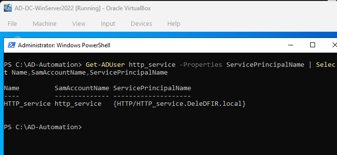

Configured the automated AD provisioning workflow to create the dedicated `HTTP_service` account and register its `HTTP/HTTP_service.De leDFIR.local` SPN, enabling controlled Kerberoasting validation.

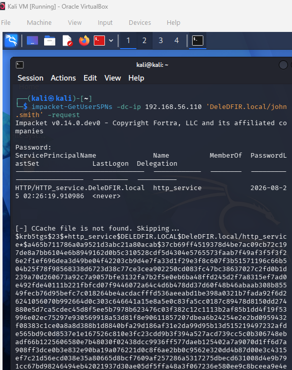

Used a low-privileged domain account with Impacket `GetUserSPNs` to enumerate the exposed SPN and request a Kerberos TGS-REP hash for offline analysis.

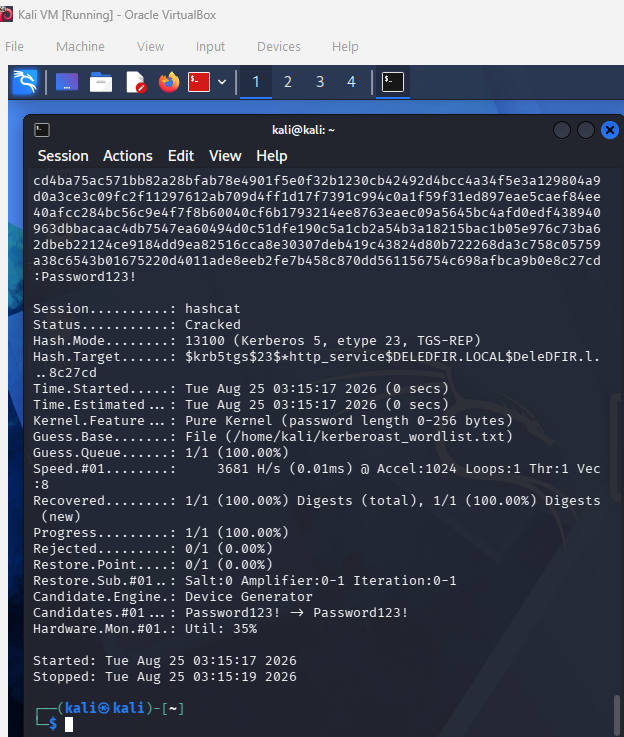

Used Hashcat with the Kerberos TGS-REP format to successfully recover the deliberately weak `HTTP_service` password, validating the credential-exposure risk.

### Summary

**Investigation Findings:** Evidence from Active Directory, Impacket, and Hashcat confirmed that the low-privileged `john.smith` account could request a TGS-REP for `HTTP_service`, whose weak password was subsequently recovered offline.

**Security Decision:** The service account was assessed against least-privilege principles and found to be limited to `Domain Users`, so remediation focused on eliminating weak service-account credentials and unnecessary SPNs rather than treating the account as privileged.

**Validation:** The workflow was validated end-to-end by confirming the SPN, capturing a `$krb5tgs$23$` hash, successfully cracking it, and verifying that `HTTP_service` had no privileged group membership, no `AdminCount`, and no unconstrained delegation.

### Operational Impact
The implementation demonstrates a full identity‑attack path that defenders can detect and mitigate by enforcing strong, unique service‑account credentials, applying least‑privilege, and removing unnecessary SPNs — directly reducing the risk of credential compromise and unauthorized resource access.