# ACTIVE DIRECTORY SECURITY & IDENTITY & ACCESS MANAGEMENT (IAM)

## Overview
Built a Windows Active Directory homelab to simulate realistic security operations, including identity and access management `(IAM)`, Joiner‑Mover‑Leaver `(JML)` lifecycle automation, access reviews, red‑team attack scenarios, and blue‑team defensive investigations. The environment provides a repeatable framework for testing, validating, and demonstrating SOC‑level identity and access controls.

## Scope & Assumptions
This project is a controlled Windows Active Directory security lab built in VirtualBox using the `DeleDFIR.local` domain, with DC1, WS01, Kali Linux and simulated IAM/JML and security-testing workflows; attack, credential-testing and intentionally vulnerable configurations are limited to this isolated environment.

---

# PART 00 — Active Directory Homelab Architecture & JML/IAM Workflow

## Objective
Provide a clear architectural view of the Active Directory homelab and its `IAM/JML` automation to demonstrate how identity, access, security testing, and validation components work together.

## Skills
- **Network & Systems Architecture Documentation** — visually mapped the Active Directory homelab infrastructure and component relationships.
- **IAM/JML Workflow Visualization** — documented the simulated identity and access workflow within the architecture.

## Tools
- **draw.io** — Used to design the architecture diagram and visually map the Active Directory infrastructure, management/automation layer, security-testing environment, and JML/IAM workflow.

## Steps

Created an architecture diagram showing the management, Active Directory infrastructure, and security-testing zones while highlighting the Part 8 flow from simulated `HR data` through `JML/IAM` automation to Active Directory access and audit evidence.

## Summary
**Security Decision:** A three-zone architecture was selected to clearly separate management and automation, identity infrastructure, and security testing while keeping the JML/IAM workflow visually prominent.

## Operational Impact
A clear architecture gives security teams a single visual reference for understanding identity flows, access changes, investigation points, and security-testing paths across the lab.

---

# PART 01 — Creating Server + Workstation Virtual Environment + Active Directory Join

## Objective
Create and configure a Windows Server 2022 and Windows 10 workstation environment, deploy the Active Directory domain, and successfully `join` the `workstation` to the `domain` as the foundation for subsequent security operations.

## Skills
- **Active Directory & Windows Server Administration:** Prepared and configured the Windows Server 2022 Domain Controller and Windows 10 workstation for the `DeleDFIR.local` environment, including AD DS installation and forest deployment.
- **Network & DNS Configuration:** Configured the VirtualBox Host-Only network, assigned DC1 a static IP and subnet, configured WS01 to use DC1 (`192.168.56.110`) for DNS, and validated domain discovery and connectivity.
- **PowerShell & WinRM:** Established remote PowerShell administration between WS01 and DC1 and validated connectivity with `Test-WSMan`.
- **Virtual Machine Administration:** Created and configured the Windows Server 2022 and Windows 10 virtual machines for the isolated AD lab.
- **Infrastructure Troubleshooting:** Resolved network-profile, static-IP, DNS, and stale-domain membership issues during environment deployment.

## Tools
- **VirtualBox:** Provided the Host-Only virtual network and isolated infrastructure for DC1 and WS01.
- **Windows Server 2022:** Hosted DC1, Active Directory Domain Services, and DNS for `DeleDFIR.local`.
- **Windows 10 Pro:** Served as WS01 and the management workstation for domain and WinRM configuration.
- **PowerShell:** Used for AD DS forest deployment, network configuration, remote administration, and validation.
- **WinRM:** Provided remote PowerShell connectivity between WS01 and DC1 for administration and configuration.

## Steps

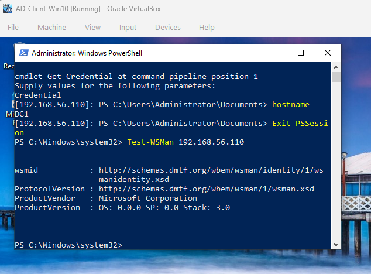

## A. Configured and validated WinRM connectivity between the Windows 10 workstation and Windows Server to support remote administration of the Domain Controller.

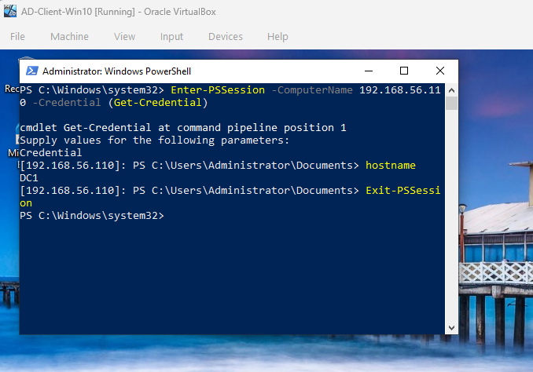

## B. Established a remote PowerShell session and configured the Windows Server hostname as `DC1`.

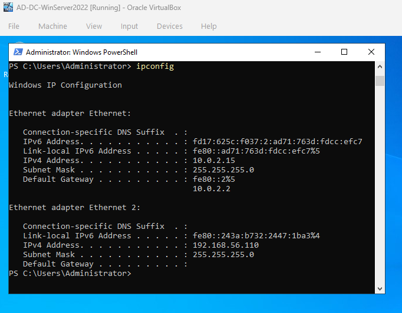

## C. Assigned `DC1` the persistent Host-Only IP address `192.168.56.110` to provide reliable communication for domain services.

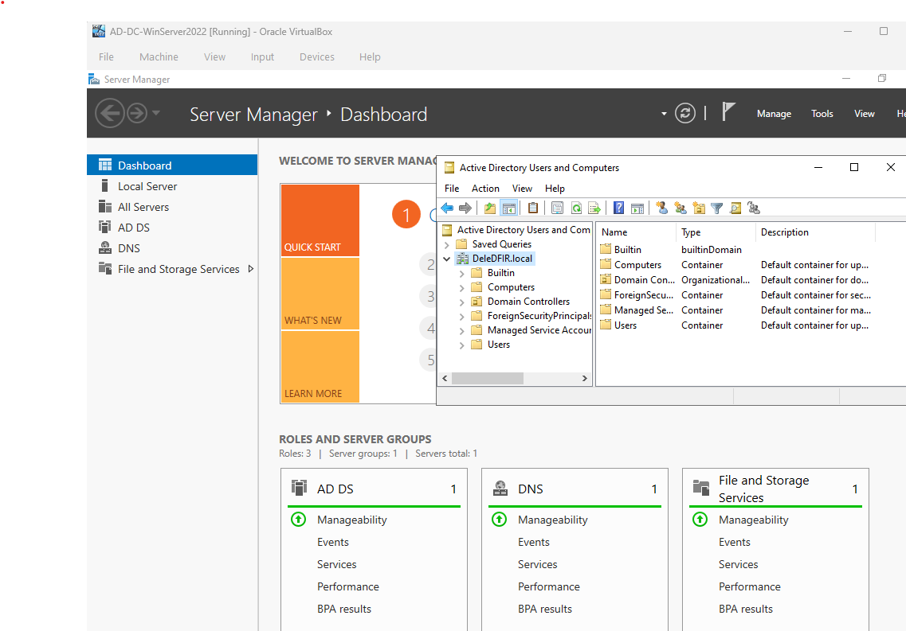

## D. Installed Active Directory Domain Services and promoted `DC1` to the Domain Controller for the `DeleDFIR.local` forest.

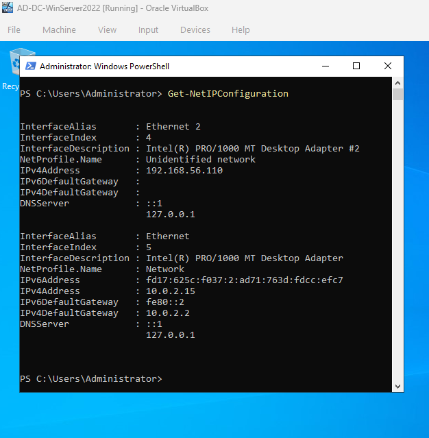

## E. Verified the Domain Controller network interfaces and confirmed DNS was configured to point to `DC1`.

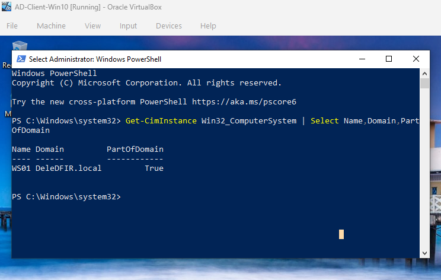

## F. Configured `WS01` to use the Domain Controller for DNS and successfully joined it to the `DeleDFIR.local` domain.

## Challenges & Troubleshooting
`WS01` initially could not discover the `domain` because its `DNS` configuration was incorrect and the cloned workstation remained associated with the unavailable *DFIR.local* domain. The issue was identified through *network and domain* configuration checks, after which `WS01` was moved to `WORKGROUP`, configured to use `192.168.56.110` for `DNS`, and successfully `joined` to *DeleDFIR.local*.

## Summary
- **Investigation Findings:** Configuration evidence confirmed successful `DC1` promotion, `DNS` configuration, network connectivity and `WS01` reporting *PartOfDomain: True* for *DeleDFIR.local*.
- **Security Decision:** A dedicated *Host-Only network and static Domain Controller IP* were used to provide predictable and controlled communication between the Active Directory systems.
- **Validation:** `WinRM` connectivity, `hostname` configuration, static IP configuration, `AD DS` deployment, `DNS` configuration, and the final `domain-join` status were validated through `PowerShell` and Windows configuration evidence.

## Operational Impact
Established a controlled Windows Active Directory environment that provides a reliable foundation for subsequent identity management, security testing, and SOC-focused monitoring activities.

---

# Part 02 — Automating Domain Users

## Objective
Automate *Active Directory user and group* provisioning to reduce manual account-creation errors and provide a repeatable, controlled method for building `domain-user` environments.

## Skills
- **Active Directory & Windows Administration** — automated Active Directory user and group provisioning and validated domain-user authentication on WS01.
- **PowerShell & JSON Automation** — developed `gen-ad.ps1` with JSON-driven configuration for user creation, group creation, membership assignment, validation, and remote deployment.
- **Identity & Access Management** — implemented user provisioning, group membership assignment, account configuration, and standard-user access validation.
- **Domain Authentication & Access Validation** — verified domain-user authentication and group membership using `whoami /groups`.
- **WinRM & Remote Administration** — transferred automation files and executed the provisioning workflow remotely on DC1.
- **Infrastructure Troubleshooting** — investigated and resolved DNS, time synchronization, firewall, and workstation trust issues affecting domain authentication.

## Tools
- **Windows Server 2022 & Active Directory:** Domain Controller, identity, user/group management, and validation.
- **Windows 10 & WS01:** Domain workstation and authentication testing.
- **PowerShell:** Automated and configured repeatable user/group provisioning and validation.
- **JSON:** Defined the user, group, and domain configuration consumed by the automation.
- **VS Code:** Developed the PowerShell automation and JSON configuration.
- **WinRM:** Provided remote administration and file transfer to `DC1`.
- **Active Directory Users and Computers:** Verified provisioned users, groups, and memberships.

## Steps

[View PowerShell AD Automation Files](./PowerShell-AD-Automation/)

### JSON-Based AD Configuration

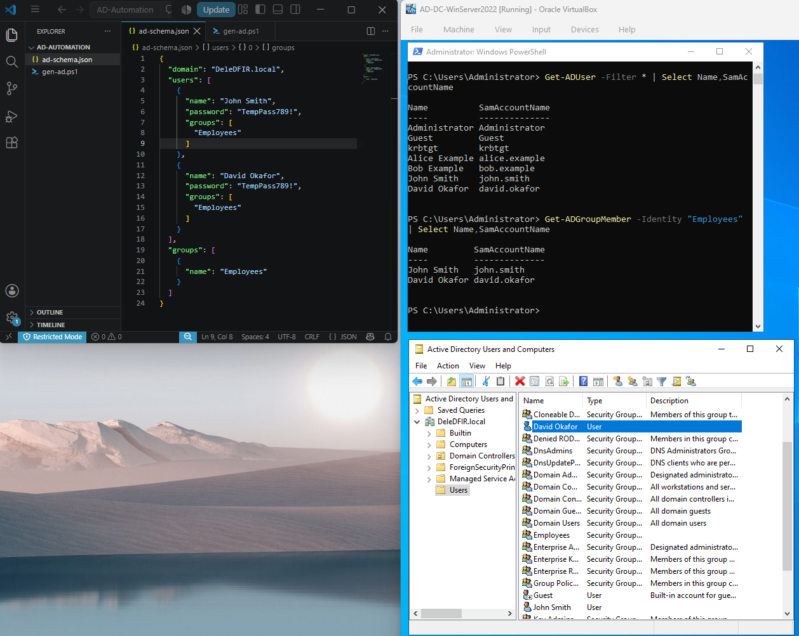

Created `ad-schema.json` to define users, groups, memberships, and domain configuration, then parsed the JSON with PowerShell and transferred the automation files to `DC1` using WinRM.

### PowerShell AD Automation

Implemented `gen-ad.ps1` with a mandatory JSON input parameter, JSON parsing, user-processing functions, secure random password generation, username/UPN/SAM account generation, secure-string password handling, and support for multiple group memberships.

### Automated User & Group Provisioning

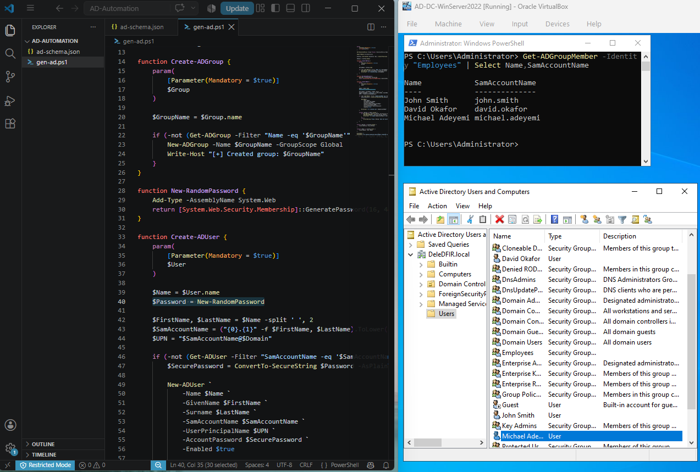

Automated Active Directory group and user creation, enabled provisioned accounts, validated configured groups with `Get-ADGroup`, assigned users to their groups, and added error handling for missing groups. Executed the generator on `DC1` and verified the resulting users, groups, and memberships.

### Domain Authentication & Troubleshooting

Investigated domain authentication failures involving workstation trust, DNS, time synchronization, and firewall configuration. Removed and rejoined `WS01` to `DeleDFIR.local`, then restarted the workstation to restore domain authentication.

### Domain Authentication & Validation

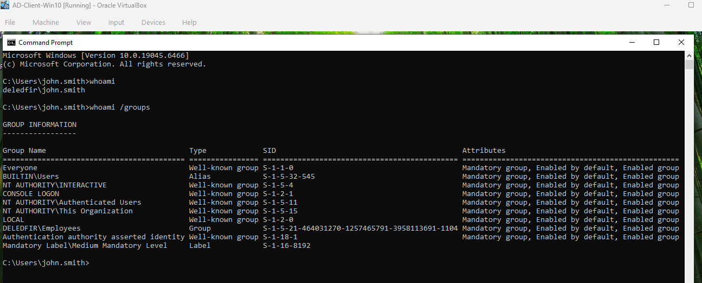

Validated successful authentication as a standard domain user on `WS01` and confirmed `Employees` group membership using `whoami` and `whoami /groups`. Confirmed the environment could be regenerated from the JSON-based configuration.

## Summary
- **Investigation Findings:** Evidence from PowerShell execution, *Active Directory Users and Computers*, and workstation authentication confirmed that the JSON-driven automation successfully created enabled domain users and assigned them to the `Employees` group.
- **Security Decision:** PowerShell automation with structured `JSON` configuration and secure random password generation was selected to reduce manual provisioning errors and avoid the intentionally weak credentials used in the reference vulnerable workflow; a known password was temporarily set for `John Smith` solely to validate domain authentication.
- **Validation:** The workflow was validated through successful `JSON` parsing and `WinRM` file transfer, creation of the `Employees` group and configured AD users, confirmation of user enablement and group membership, and successful `john.smith` authentication on `WS01` verified with `whoami` and `whoami /groups`.

## Operational Impact
Automated identity provisioning reduces manual administrative effort, improves consistency in account and access configuration, and provides a repeatable process for onboarding users and validating domain access.

---

# PART 03 — PowerShell: Random Users & Weak Passwords

## Objective
Automate randomized Active Directory user and group provisioning to create a controlled security-testing environment for identifying authentication, password-policy, and account-management risks.

## Skills
- **PowerShell & Active Directory Automation** — developed randomized user/group generation and JSON-driven deployment workflows for repeatable AD environment provisioning.
- **Identity & Access Management** — automated user creation, group assignment, account enablement, and validation across the domain environment.
- **Password Policy & Authentication Security** — tested password-length and complexity requirements and validated their effect on automated account creation and domain authentication.
- **Group Policy Validation** — verified Default Domain Policy application on WS01 using `rsop.msc`, `gpresult`, and Active Directory policy checks.
- **Network & Remote Administration** — used WinRM and PowerShell remoting for file transfer, remote provisioning, and troubleshooting of domain connectivity.
- **Security Testing & Validation** — tested randomized account provisioning, authentication, password-policy enforcement, and generated-account states, with evidence collected from DC1 and WS01.
- **Infrastructure Troubleshooting** — diagnosed JSON serialization, group-handling, WinRM/SMB transfer, password-policy, and authentication issues and corrected the provisioning workflow.

## Tools
- **Visual Studio Code** — Used to create and edit the PowerShell automation scripts, JSON schema, and randomized data files.
- **PowerShell** — Automated randomized user/group generation, provisioning, validation, and troubleshooting.
- **Active Directory Domain Services** — Hosted and managed the simulated enterprise identities, groups, and authentication.
- **Windows Server 2022** — Provided the domain controller and security-policy environment.
- **Windows 10** — Served as the domain workstation for authentication and Group Policy validation.
- **WinRM / PowerShell Remoting** — Supported secure administration and deployment between the lab systems.

## Steps

[View PowerShell AD Automation Files](./PowerShell-AD-Automation/)

### Random Active Directory Environment Generation
Created reusable first-name, last-name, group-name, and weak-password data sources, then built a PowerShell generator to produce randomized Active Directory environments.

### Random Data & Group Selection
Loaded the data sources, implemented randomized group selection with unique assignments, and corrected the initial `Get-Random` data-loading issue that caused file-object metadata to appear in the generated output.

### Random User Generation & JSON Structure
Configured the generator for 20 randomized users with unique names, passwords, and group assignments. Structured the generated domain, groups, and users into `out.json` and resolved PowerShell array/scalar serialization issues to align the output with the existing AD schema.

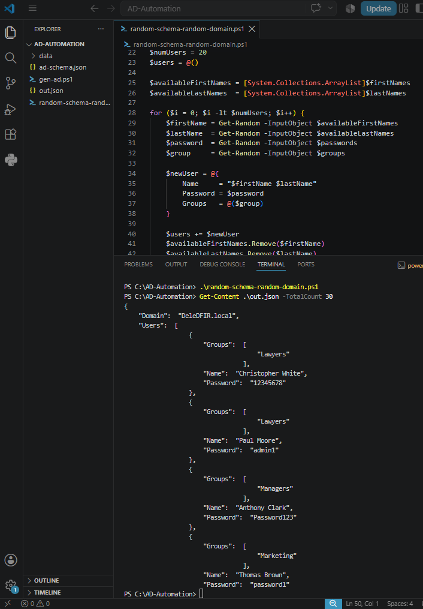

### Random Domain Deployment & Troubleshooting
Transferred the generated JSON and provisioning script to `DC1`, resolved WinRM/SMB file-transfer issues using `Copy-Item -ToSession`, corrected group-name handling between the JSON output and provisioning script, and verified 9 generated AD groups, users, and memberships.

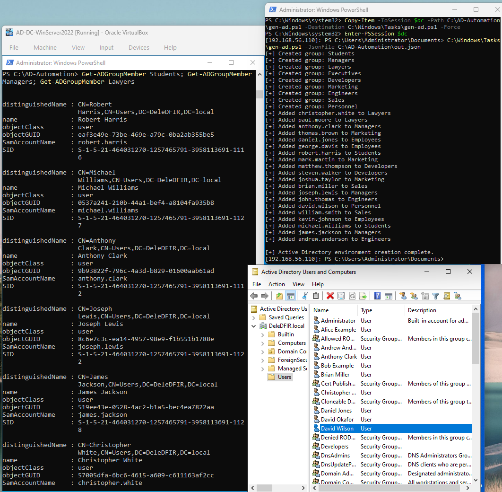

### Password Policy & Authentication Testing
- Integrated password-policy testing into the provisioning workflow, investigated password-length failures during account creation, and validated the resulting domain authentication from `WS01`.
- When `james.jackson` initially failed authentication because the generated password did not satisfy the configured password policy, verified that the account existed, reset it to a compliant test password, and successfully authenticated to `WS01`.
- Confirmed Default Domain Policy application using `rsop.msc` and `gpresult`, and verified the domain password-policy configuration through Active Directory checks.

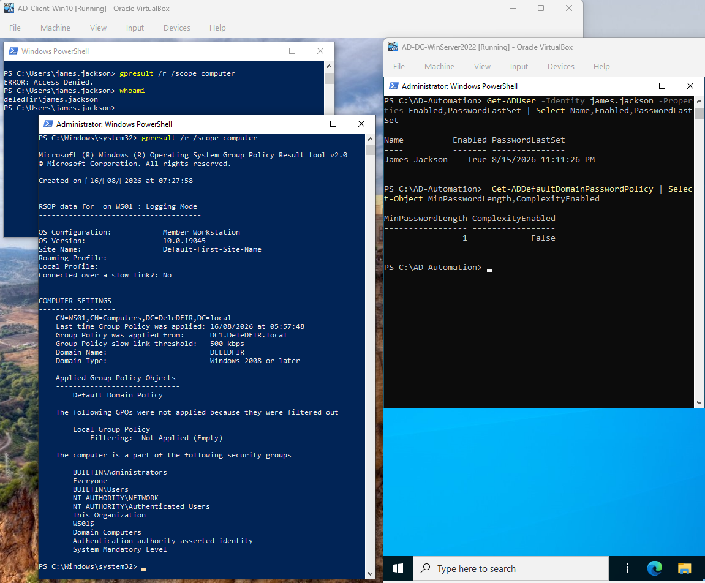

### Random Domain Validation & Authentication
Rejoined `WS01` to `DeleDFIR.local`, validated the 20 generated domain users and their authentication state, inspected `secpol.cfg` on `DC1` to verify password-policy configuration, and removed `out.json` after testing to avoid leaving generated credentials in the project directory.

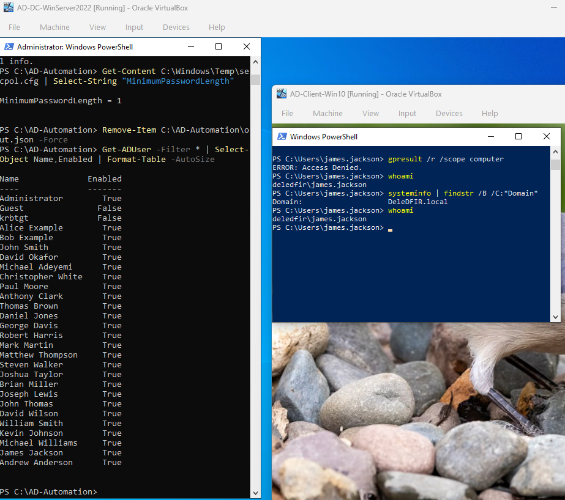

## Challenges & Troubleshooting
Initial `JSON` output contained `metadata` instead of strings; corrected data‑loading logic to ensure clean schema. Encountered `WinRM/SMB` transfer failures and group‑creation errors, resolved by adjusting remoting workflow and fixing group‑handling logic.
Password-policy authentication failed because generated passwords did not meet the domain requirements; I confirmed the account state with AD queries, then reset the test account to a compliant password and successfully authenticated from WS01.

## Summary

### Investigation Findings
Active Directory and workstation evidence confirmed 20 generated users, successful domain authentication, Default Domain Policy application, and a final domain password policy with a 1-character minimum password length and complexity enabled.

### Security Decision
Used randomized identities and controlled weak-password testing within the isolated lab to evaluate account provisioning, password-policy enforcement, and authentication behavior.

### Validation
Confirmed generated accounts and group memberships, verified successful domain authentication and Group Policy application on WS01, and removed temporary `out.json` credentials after testing.

## Operational Impact
The project provides a repeatable identity-testing environment for generating AD users and groups, testing password-policy enforcement and authentication behavior, and validating account provisioning consistently during security testing.

---

# Part 04 — Building a Reversible Active Directory Lab

## Objective
Build a deliberately vulnerable and repeatable Active Directory lab to support controlled security testing while demonstrating the ability to create, validate, revert, and rebuild domain security configurations.

## Skills
- **Active Directory & Windows Administration:** Managed generated domain users and groups, configured and restored password policies, validated domain authentication, and managed WS01 domain membership.
- **PowerShell Automation:** Built and tested reversible AD automation to provision and remove generated users/groups and restore the domain password policy with the `-Undo` workflow.
- **Identity & Access Management:** Validated domain-user authentication, account removal and recreation, password-policy controls, and WS01 secure-channel health.
- **System Administration:** Administered DC1 and WS01 through domain configuration, local/remote administration, troubleshooting, and recovery after the AD automation revert.
- **Networking & Remote Administration:** Configured DNS and SMB connectivity, established PowerShell Remoting between WS01 and DC1, transferred automation files, and resolved file-transfer issues using WinRM and VirtualBox Shared Folders.

## Tools
- **Visual Studio Code:** Script and JSON configuration editing.
- **Windows Server 2022 & Active Directory:** Domain controller, identity management, and security policy administration.
- **Windows 10 Pro:** Domain workstation and authentication testing.
- **PowerShell:** Infrastructure automation, administrative scripting, and remote management.
- **VirtualBox & Shared Folders:** Isolated virtualization, snapshots, and file transfer.
- **Git:** Version control and evidence tracking.

## Steps

### Domain Controller Preparation

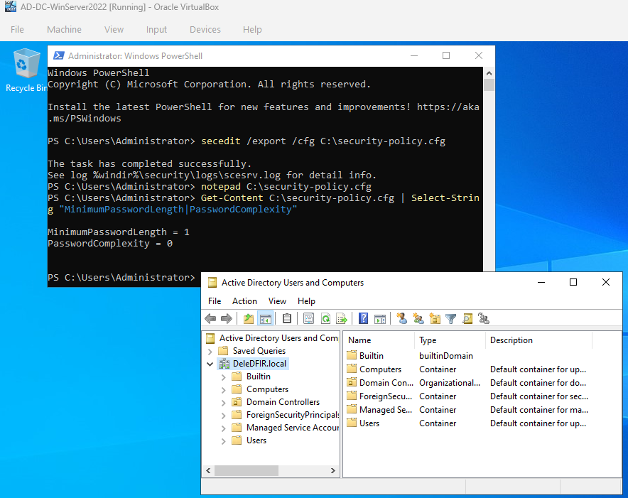

Configured and validated the `DeleDFIR.local` Domain Controller and intentionally weak password policy to establish the controlled environment required for subsequent Active Directory security testing.

### Password Policy & AD Automation

[View PowerShell AD Automation Files](./PowerShell-AD-Automation/)

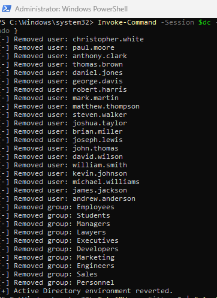

Executed the AD automation `-Undo` workflow to remove generated Active Directory users and groups, demonstrating that the vulnerable environment could be safely reversed.

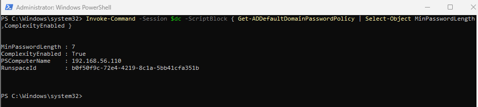

Verified that the undo workflow restored the domain password policy to the stronger baseline of a 7-character minimum with password complexity enabled.

### Workstation Domain Join & Remote Administration

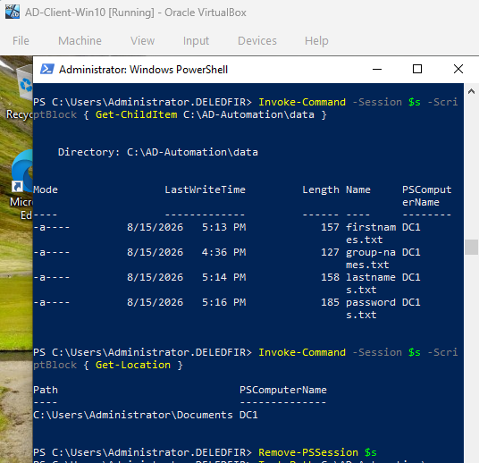

Removed and rejoined WS01 to `DeleDFIR.local`, established PowerShell Remoting to DC1, and transferred the automation files for centralized Active Directory management.

### Active Directory User Validation

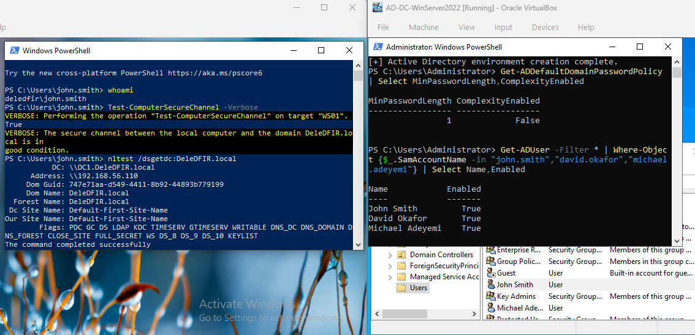

Generated domain users with intentionally weak credentials and validated successful domain authentication, secure-channel health, and Domain Controller discovery from WS01.

### Reversible Environment Management
Validated the automation lifecycle by removing generated users and groups, restoring the stronger password policy, and confirming the environment could be recreated for repeatable security testing.

## Challenges & Troubleshooting
After the AD automation `-Undo` workflow removed generated accounts, `WS01` remained domain-joined and the previously used domain account was unavailable, so access was recovered through the existing local Administrator account without rebuilding the workstation.  
*Host-to-WS01 SMB transfer* also failed after the domain rejoin, so VirtualBox *Shared Folders* were used to transfer the automation data before PowerShell Remoting was used to copy it to `DC1`.

## Summary
- **Investigation Findings:** Evidence confirmed an intentionally weak password policy (`MinimumPasswordLength = 1`, `PasswordComplexity = 0`), successful domain-user authentication, healthy WS01 secure-channel status, and successful discovery of DC1.
- **Security Decision:** A reversible PowerShell automation workflow was used to make the vulnerable AD state repeatable while allowing generated security objects and policy changes to be safely removed and restored.
- **Validation:** The environment successfully authenticated a generated domain account from WS01, validated the domain connection, and restored the baseline password policy through the automation workflow.

## Operational Impact
A repeatable vulnerable AD environment allows SOC teams to safely reproduce authentication and identity-related attack conditions, validate detection and response workflows, and reset the environment quickly for repeated investigations.

---

# Part 05 — Brute-Forcing Domain Passwords

### Objective
Assess the resilience of a controlled Active Directory environment against credential attacks and identify password-policy weaknesses that could increase account-compromise risk.

### Skills
- **Active Directory Security Assessment:** Enumerated 28 domain users, domain computers, AD groups, SMB shares, and the weak domain password policy using NetExec.
- **Credential Testing:** Tested `users.txt` and `test-passwords.txt` against DC1 over SMB and validated `andrew.anderson:Password1` as a working low-privileged credential.
- **Network Enumeration:** Used Nmap to identify DC1's DNS, Kerberos, LDAP, SMB, and WinRM services and validated TCP/445 connectivity from Kali.
- **System Administration:** Configured Kali Linux, prepared the credential-testing workspace, managed wordlists, and validated connectivity to DC1 and WS01.
- **Evidence Collection & Troubleshooting:** Investigated `STATUS_LOGON_FAILURE`, confirmed the 20 target accounts remained present, identified stale `out.json` credentials, and traced the working password through PowerShell history.
- **Security Validation & Risk Assessment:** Used the recovered low-privileged credential to demonstrate access to domain information and confirm the security impact of `MinimumPasswordLength = 1` and `PasswordComplexity = 0`.

### Tools
- **Kali Linux:** Attack workstation for credential-testing and reconnaissance.
- **Windows Server 2022 (DC1):** Domain Controller hosting the `DeleDFIR.local` Active Directory environment.
- **Windows 10 (WS01):** Domain-joined workstation for host and authentication validation.
- **NetExec:** SMB/LDAP authentication, credential validation, and Active Directory enumeration.
- **Nmap:** Network and service discovery against lab systems.
- **VirtualBox:** Isolated lab virtualization and Host-Only networking.

### Steps

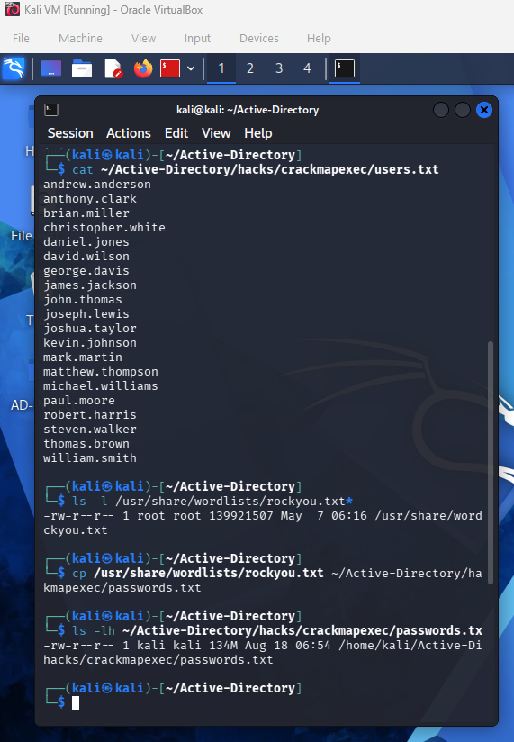

# Prepared domain usernames and a password wordlist in Kali for controlled credential testing against the Active Directory environment.

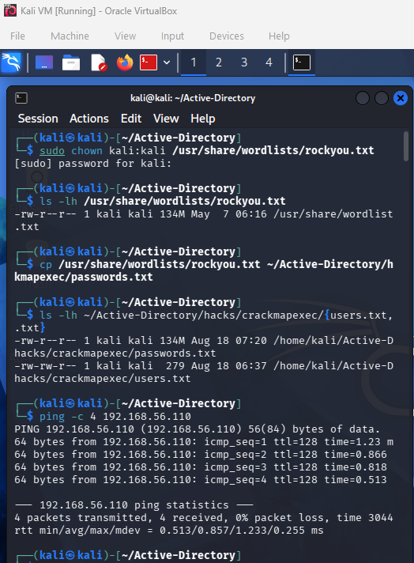

# Validated Host-Only connectivity between Kali and DC1 before conducting credential-testing activities.

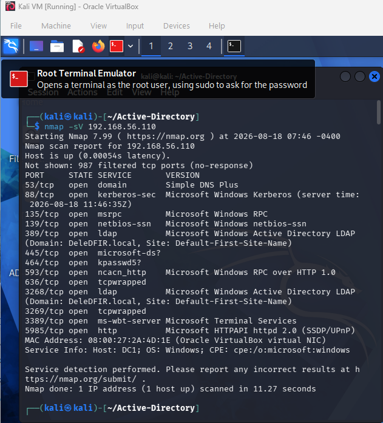

# Enumerated DC1 services with Nmap to identify exposed Active Directory services relevant to the security assessment.

# Enumerated WS01 with Nmap and confirmed RDP exposure on TCP/3389.

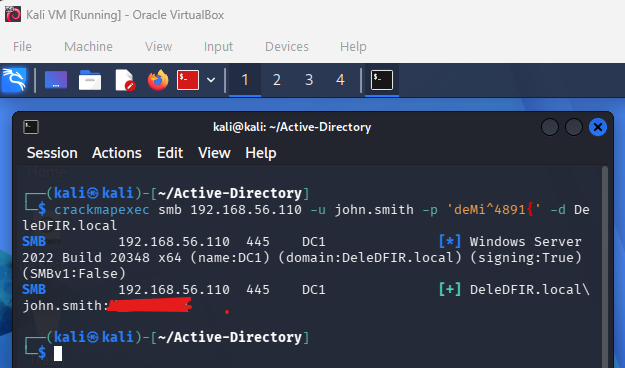

# Validated SMB connectivity and authenticated to DC1 with a domain account, confirming the credential-testing workflow was functioning.

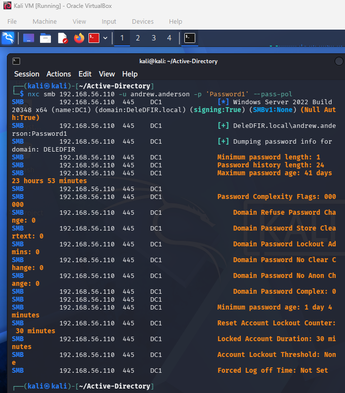

# Used the recovered low-privileged credential to validate SMB access and confirm the intentionally weak domain password policy.

# Enumerated SMB shares and confirmed READ access to IPC$, NETLOGON, and SYSVOL.

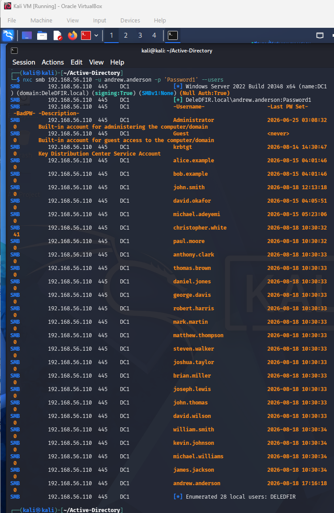

# Used the valid low-privileged credential to enumerate 28 domain user accounts through SMB.

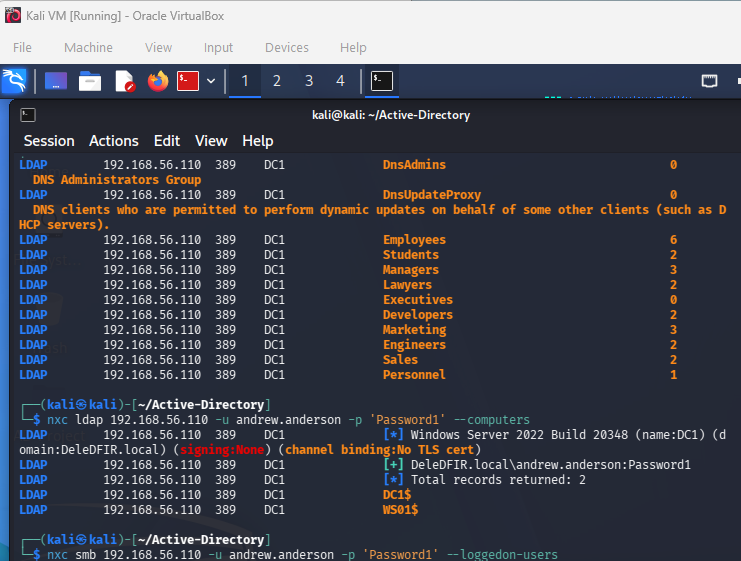

# Used LDAP enumeration to identify custom Active Directory groups and the two domain computers, `DC1$` and `WS01$`.

### Challenges & Troubleshooting
Initial credential testing produced `STATUS_LOGON_FAILURE` because `out.json` contained stale credentials from an earlier AD state; reviewing `net user /domain` and PowerShell history identified that `andrew.anderson` had been manually reset.  
The corrected credential successfully authenticated through NetExec, allowing password-policy enumeration and subsequent credentialed Active Directory reconnaissance.

### Summary
- **Investigation Findings:** Evidence from NetExec, Nmap, and Active Directory enumeration confirmed successful low-privileged SMB/LDAP access, 28 enumerated users, two domain computers, accessible `NETLOGON`/`SYSVOL` shares, and a password policy allowing one-character passwords with complexity disabled.
- **Security Decision:** SMB and LDAP were selected for credential validation and directory reconnaissance because they provided the required authentication and Active Directory visibility while remaining appropriate for the isolated lab environment.
- **Validation:** NetExec confirmed successful authentication and retrieved the configured policy values of `Minimum password length: 1` and `Domain Password Complex: 0`, demonstrating that the lab environment remained intentionally vulnerable to weak-credential risk.

### Operational Impact
The exercise demonstrates how defenders can validate credential exposure and weak Active Directory controls, producing evidence that can support detection engineering, account-risk assessment, and remediation decisions.

---

## Part 06 — BloodHound Domain Enumeration

### Objective
Map Active Directory identities, privileges, and relationships to identify potential privilege paths and improve understanding of domain security risks.

### Skills
- **Active Directory Enumeration:** Collected and analyzed domain users, groups, computers, GPOs, OUs, containers, and domain relationships using `bloodhound-python` and BloodHound CE.
- **Identity & Privilege Analysis:** Analyzed Domain Admin membership, account properties, privileged relationships, execution rights, delegation, and control permissions.
- **Attack-Path Analysis:** Reviewed potential paths from a low-privileged domain account toward higher-value targets and marked the known account as Owned for relationship analysis.
- **Security Reconnaissance:** Remotely mapped the `DeleDFIR.local` Active Directory environment from Kali without first compromising the Windows workstation.
- **System Administration:** Configured Kali, Neo4j, BloodHound CE, PostgreSQL connectivity, the BloodHound Python collector, and DNS resolution required for AD data collection.
- **Networking & Troubleshooting:** Diagnosed LDAP, DNS, and Global Catalog resolution issues and configured DC1 hostname/DNS resolution to restore remote AD enumeration.
- **Evidence-Based Investigation:** Used collected AD objects, relationships, graph data, and BloodHound queries to identify and assess privilege relationships and potential attack paths.

### Tools
- **Kali Linux:** Attack workstation used to perform remote Active Directory reconnaissance and run the BloodHound Python collector.
- **BloodHound Community Edition (CE):** Visualized Active Directory objects, relationships, privileges, and potential attack paths.
- **`bloodhound-python`:** Collected users, groups, computers, domains, GPOs, OUs, and relationship data from `DeleDFIR.local`.
- **Neo4j:** Backend graph database used to store and analyze collected Active Directory relationships.
- **PostgreSQL:** Database backend supporting the BloodHound CE environment.
- **Active Directory:** Target identity environment used for enumeration and privilege/relationship analysis.
- **PowerShell:** Supported Windows/Active Directory administration and environment validation.
- **Cypher Queries:** Used to query the BloodHound graph for Active Directory relationships and privilege paths.

### Steps

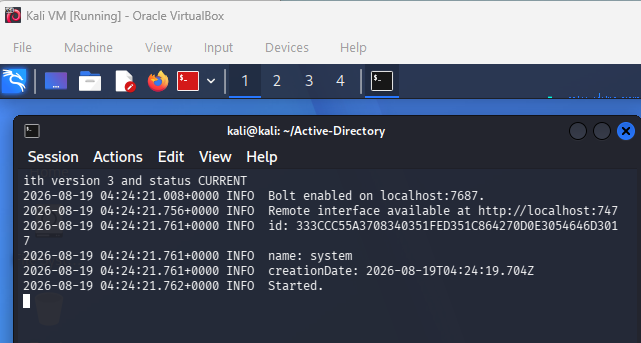

- Configured the Kali BloodHound workspace, installed and started Neo4j, and configured BloodHound CE with PostgreSQL and Neo4j, verifying successful database connectivity and BloodHound CE access.
- Installed and configured `bloodhound-python`, authenticated to `DeleDFIR.local` with the verified low-privileged domain credential, and collected users, groups, computers, domains, GPOs, OUs, containers, and relationship data.
- Configured Kali for `DeleDFIR.local` DNS resolution, troubleshooting LDAP, DNS, and Global Catalog resolution issues and validating DC1 hostname resolution through `/etc/hosts`.

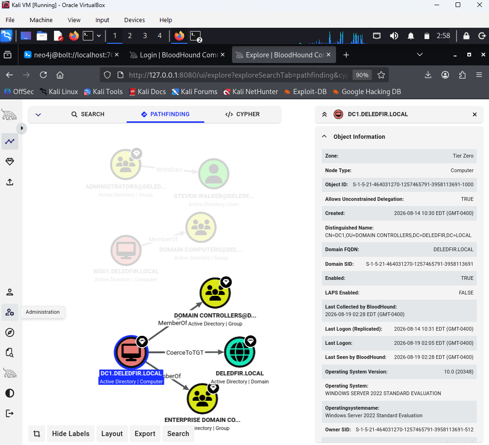

- Expanded BloodHound collection to `All` methods and imported the generated JSON data into BloodHound CE backed by Neo4j for Active Directory relationship and attack-path analysis.
- Analyzed Domain Admins, domain users, group memberships, account properties, privileged relationships, administrative and execution rights, delegation, control permissions, and potential attack paths.
- Marked the known low-privileged domain account as **Owned** and used BloodHound's analysis and query features to assess paths toward higher-privileged resources.

### Challenges & Troubleshooting
BloodHound initially encountered *Kerberos, DNS, and Global Catalog resolution issues* when attempting to reach `DC1`, evidenced by collector connection errors and hostname-resolution failures. Configured `Kali` to resolve the domain through the Domain Controller and validated hostname resolution, after which `BloodHound` successfully collected and exported the Active Directory data.

### Summary
- **Investigation Findings:** BloodHound successfully collected evidence covering 2 computers, 29 users, 62 groups, 2 GPOs, 1 OU, and 19 containers, enabling analysis of Active Directory relationships and privilege paths.

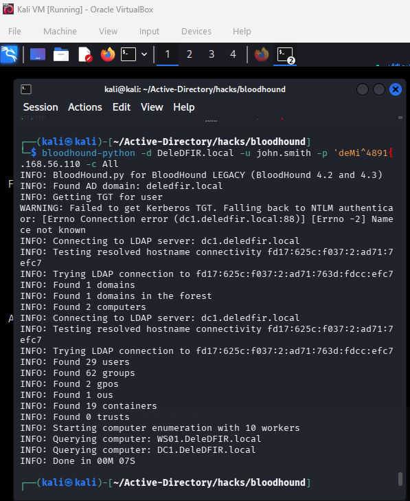

- **Security Decision:** BloodHound was selected because relationship-based AD analysis provides visibility into how low-privileged accounts, groups, computers, and privileged resources are connected.
- **Validation:** Successful JSON collection, import into BloodHound CE, and visualization of `DeleDFIR.local` relationships confirmed that the enumeration workflow was functioning correctly.

### Operational Impact
BloodHound gives SOC and security teams a relationship-based view of Active Directory that can accelerate investigation of privilege exposure, account relationships, and potential attack paths.

---

# PART 07 — PowerShell: Automating Random Local Administrators

## Objective
Automate the generation and assignment of controlled local administrator accounts in an Active Directory environment to support repeatable privilege-management and security testing.

### Skills
- **PowerShell Automation:** Modified the generator to accept `UserCount`, `GroupCount`, and `LocalAdminCount` parameters and implemented array-based random index selection with `Get-Random`, duplicate exclusion, and looping to generate the requested administrator count.
- **Active Directory Administration:** Updated `gen-ad.ps1` to assign designated domain users to the local `Administrators` group on DC1 using domain-qualified usernames.
- **Privileged Account Management:** Generated eight domain users, designated exactly three as local administrators, and verified their membership in the local `Administrators` group.
- **Identity & Access Management:** Used the `LocalAdmin` property in the generated JSON schema to control which domain identities received elevated local privileges.
- **Security Testing:** Rebuilt the AD environment with eight users and three designated local administrators to test the automated privilege-assignment workflow.
- **Troubleshooting & Validation:** Corrected administrator-index handling, tested an alternative local-group assignment method after the PowerShell approach failed, and verified the final assignments with `net localgroup administrators`.
- **Evidence-Based Validation:** Compared the generated JSON configuration with the rebuilt AD environment and confirmed that the three designated users were present in the local `Administrators` group.

### Tools
- **PowerShell:** Automated user, group, and random local administrator generation and privilege assignment.
- **Active Directory:** Provided the identity and privilege-management environment for the generated accounts.
- **Windows Server 2022:** Hosted DC1 and the local `Administrators` group used to verify privilege assignments.
- **PowerShell Remoting:** Enabled remote administration and transfer of the updated AD automation files to DC1.
- **VirtualBox:** Provided the isolated virtual lab environment for testing the AD automation workflow.

## Steps

[View PowerShell AD Automation – Part 7](./PowerShell-AD-Auto-07/)

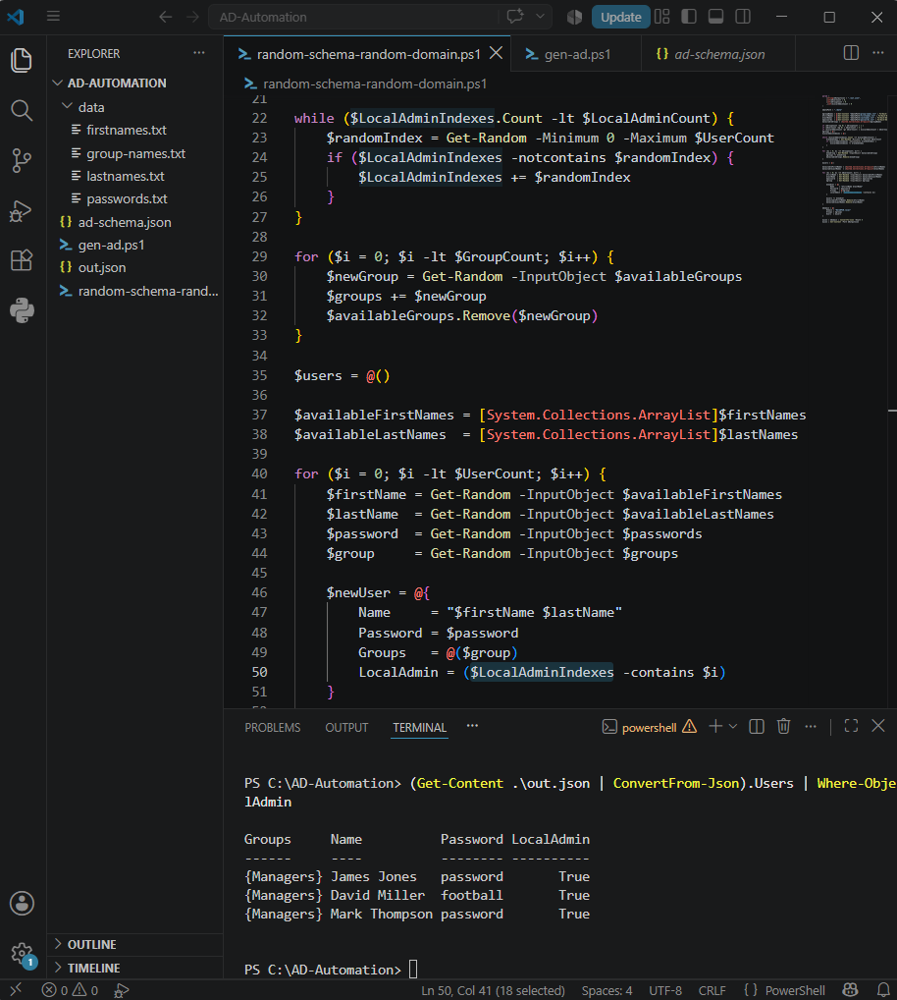

- Modified the PowerShell generator with `UserCount`, `GroupCount`, and `LocalAdminCount` parameters and implemented unique random administrator selection using arrays, `Get-Random`, duplicate exclusion, and looping.
- Updated the generated JSON schema to include the `LocalAdmin` property and designate the selected users for local administrator assignment.

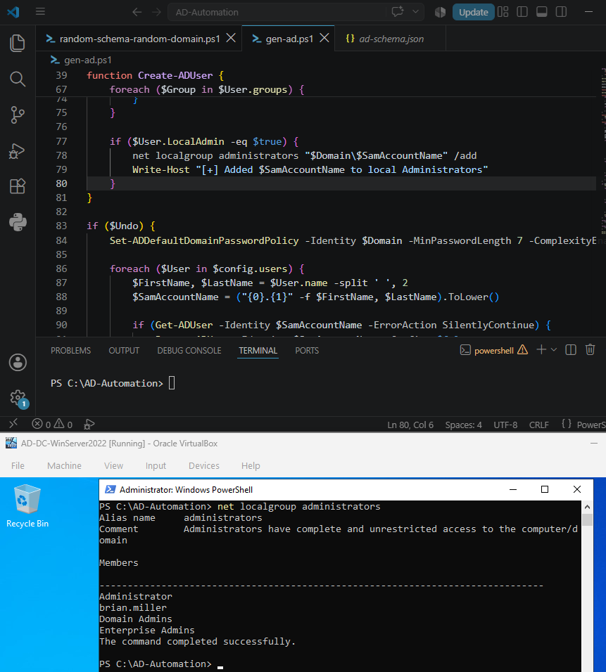

- Updated `gen-ad.ps1` to read each user's `LocalAdmin` property and add designated domain accounts to the local `Administrators` group on DC1 using domain-qualified usernames.
- Tested the local administrator assignment after the PowerShell local-group method failed as expected, then verified the assignment with `net localgroup administrators`.

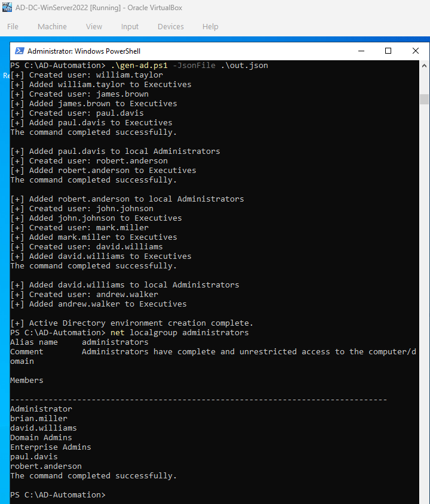

- Connected to DC1 through PowerShell Remoting, transferred the updated automation files, removed the previous generated users and groups, and rebuilt the environment with eight users and three designated local administrators.
- Verified that `paul.davis`, `robert.anderson`, and `david.williams` were members of the local `Administrators` group on DC1 and confirmed that the current implementation assigns local administrator privileges only on the Domain Controller.

## Challenges & Troubleshooting
The initial generated JSON contained 20 users and no `LocalAdmin` properties because DC1 was using an older 1,597-byte copy of the generator, which was identified by inspecting the script contents and file metadata.  
The updated 2,123-byte script was copied through the VirtualBox shared-folder workflow to DC1, after which the JSON correctly contained eight users and three `LocalAdmin: true` entries and the AD generator successfully assigned all three accounts.

## Summary
- **Investigation Findings:** Evidence from the generated JSON and `net localgroup administrators` confirmed that exactly eight test users were generated and three designated accounts received local administrator privileges.
- **Security Decision:** A configurable and randomized administrator-assignment approach was selected to make privileged-account scenarios repeatable while avoiding hard-coded administrator identities.
- **Validation:** The control was validated by confirming three `LocalAdmin: true` entries in the JSON and three corresponding generated users in DC1's local `Administrators` group.

## Operational Impact
Automating repeatable privileged-account scenarios gives SOC teams a consistent way to generate, test, and validate identity-based detections while reducing manual configuration effort.

---

# PART 08 — Joiner, Mover, Leaver (JML) & Simulated Access Review

## Objective
Automate employee lifecycle access management to reduce the risk of inappropriate, excessive, or retained Active Directory access when employees join, change roles, or leave.

## Skills
- **JML Provisioning:** Modified `gen-ad.ps1` to provision Sarah Johnson from HR record `EMP004` and assign the baseline `Employees` group during Joiner processing.
- **Access Administration:** Modified the Leaver workflow to detect `Terminated`, disable Sarah Johnson's AD account, and remove her configured group access without deleting the identity.
- **Access Review:** Exported David Okafor's current AD memberships to `David_Access_Review.csv`, reviewed the access items, and documented the retain decisions for `Domain Users` and `Employees`.
- **PowerShell & JSON Automation:** Extended the existing automation to process HR fields including `EmployeeID`, `Department`, `Title`, and `Status` from the JSON source records.
- **Audit Logging:** Implemented `jml-audit.log` to record Sarah Johnson's account disablement and access revocation as remediation evidence.
- **Lifecycle Validation:** Verified the Joiner account attributes and baseline access, the Leaver's disabled state and revoked access, and the Mover's applied review decision against the corresponding HR lifecycle events.

## Tools
- **Active Directory:** Provisioned and managed user identities, group memberships, account disablement, and access validation.
- **PowerShell:** Automated Joiner/Leaver processing, access changes, validation, and audit logging.
- **JSON:** Served as the simulated HR/source identity record for lifecycle events.
- **Windows Server / WinRM:** Hosted the AD environment and enabled remote execution and administration of the JML workflow.
- **GitHub:** Version-controlled the automation scripts, JSON records, documentation, and project evidence.

## Steps

[View PowerShell JML/IAM Automation – Part 8](./PowerShell-JML-IAM-Automation/)

### Joiner — HR Record to AD Access

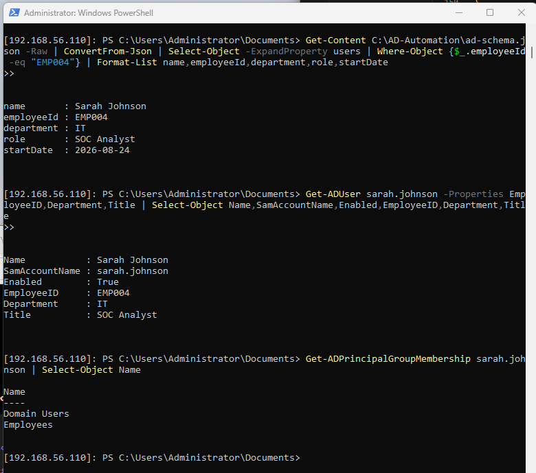

- Modified `gen-ad.ps1` to process Joiner HR fields including `EmployeeID`, `Department`, and `Title`, updated the JSON source record, transferred the updated script and JSON to DC1 through WinRM/file transfer, and provisioned Sarah Johnson with baseline `Employees` access.
- Validated Sarah's AD account attributes and group membership, documenting the source identity → provisioning → AD account → access result.

### Leaver — Automated Access Revocation

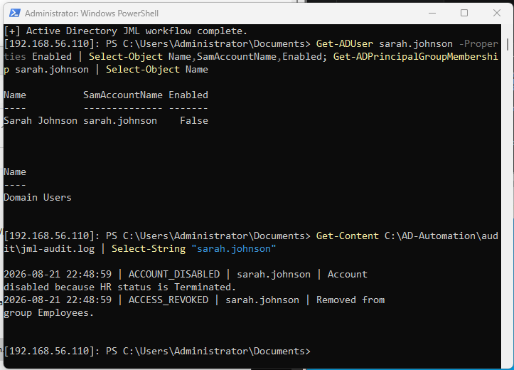

- Added Leaver logic to `gen-ad.ps1` to detect `Status = "Terminated"`, disable the corresponding AD account, remove its configured group access without deleting the identity, and record the remediation in `jml-audit.log`.
- Validated Sarah Johnson's disabled account state, revoked `Employees` access, and confirmed the remediation entries in the audit log.

### Mover — Role Change & Access Review

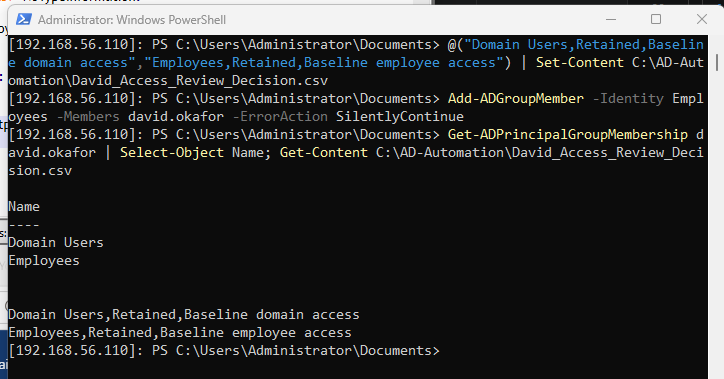

- Changed David Okafor's department/role in the HR JSON record, transferred the updated record to DC1, and exported his existing AD group memberships to `David_Access_Review.csv`.
- Reviewed the exported access, documented the decision to retain `Domain Users` and `Employees`, applied the retained `Employees` membership with PowerShell, and validated the final AD access state.

## Challenges & Troubleshooting
The existing AD automation did not initially support *HR lifecycle attributes*, termination handling, or access-review decisions, so the PowerShell workflow was extended without removing the existing provisioning capability.  
The workflow was validated against the `HR JSON` source and Active Directory outputs, confirming that the `Leaver` path disabled the terminated account and removed `Employees` access while the `Mover` review preserved approved baseline access.

## Summary
- **Investigation Findings:** Evidence from the *HR source records, Active Directory membership checks, and JML audit log* confirmed that lifecycle changes could be mapped to specific identity provisioning, deprovisioning, and access-review outcomes.
- **Security Decision:** A JSON-driven PowerShell workflow was selected to provide repeatable lifecycle enforcement while keeping identity changes, access decisions, and remediation actions auditable.
- **Validation:** Three lifecycle scenarios were validated—one Joiner provisioned with baseline access, one Leaver disabled with access revoked and audited, and one Mover reviewed with approved access retained.

## Operational Impact
Automating JML and access-review actions reduces manual identity-management effort, improves consistency of access decisions, and gives SOC/IAM teams auditable evidence for assessing and remediating inappropriate or outdated access.

---

# PART 09 — Compromising Windows Hosts w/ Impacket

## Objective
Demonstrate how compromised administrative credentials could be used to remotely execute commands on Windows hosts and assess the resulting security exposure.

## Skills
- **Windows Administration & Security:** Corrected WS01 DNS/domain connectivity, validated Windows administrative access, and assessed DC1/WS01 remote-management exposure.
- **Network & SMB Enumeration:** Used NetExec and Nmap to enumerate domain users/computers, map WS01/DC1 addresses, and identify SMB/445, WinRM, and WMI/RPC exposure.
- **Identity & Access Management:** Used authenticated SMB enumeration to verify `Administrator` had local-administrator access on WS01 before execution testing.
- **Remote Execution & Lateral Movement:** Tested Impacket `psexec`, `smbexec`, and `wmiexec`, confirming SYSTEM execution through PSExec/SMBExec and documenting WMIExec failure.
- **Privilege Verification:** Used `whoami` and `whoami /priv` to verify `NT AUTHORITY\SYSTEM` execution and document the resulting privileges.
- **Endpoint Security Analysis:** Documented Microsoft Defender detecting the Impacket WMIExec payload during remote-execution testing.
- **Attack-Path Analysis:** Marked `Administrator` as **Owned** in BloodHound and assessed WS01 outbound object-control relationships, confirming 0 identified outbound relationships.
- **Security Investigation & Documentation:** Compared execution results with exposed services and recorded the final target, account, protocol, port, execution result, and privilege level.

## Tools
- **NetExec (NXC):** Enumerated Windows hosts, validated credentials, and identified writable administrative shares.
- **Nmap:** Discovered reachable systems and mapped IP addresses.
- **Impacket:** Tested PSExec, SMBExec, and WMIExec remote execution techniques.
- **BloodHound:** Assessed Active Directory relationships and attack-path exposure.
- **Microsoft Defender:** Provided endpoint detection during the WMIExec execution attempt.

## Steps

### Windows Host & SMB Enumeration
NetExec and Nmap identified WS01 (`192.168.56.102`) and confirmed SMB/445 exposure, while authenticated SMB enumeration verified Administrator's local-administrator access and confirmed writable `ADMIN$` and `C$` shares.

### PSExec Remote Execution

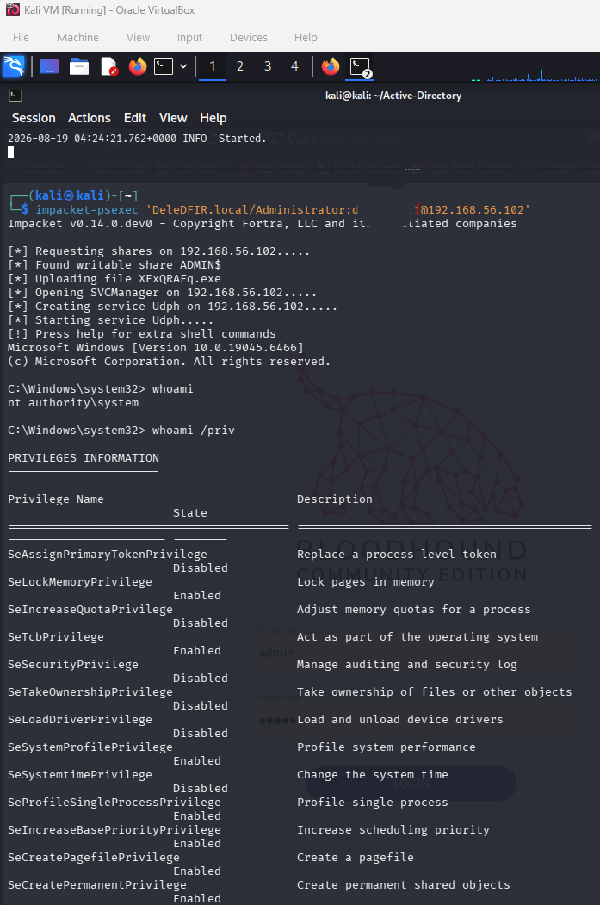

Impacket PSExec used the confirmed administrative credentials to access WS01 through `ADMIN$`, create a temporary service, and obtain an `NT AUTHORITY\SYSTEM` shell.

### SMBExec Remote Execution
SMBExec successfully established a semi-interactive shell on WS01 and confirmed execution as `NT AUTHORITY\SYSTEM`, demonstrating a second viable SMB-based execution path.

### WMIExec & Endpoint Detection
WMIExec was tested against WS01 and DC1 but did not establish a shell, while Microsoft Defender detected the remote-execution payload during the attempt.

### Privilege & Attack-Path Validation
`whoami /priv` confirmed the privileges available to the `NT AUTHORITY\SYSTEM` session, while BloodHound marked the compromised Administrator account as **Owned** and showed zero outbound object-control relationships for WS01.

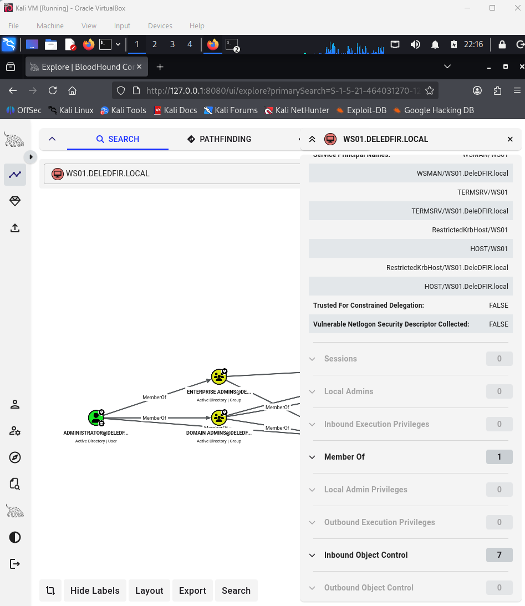

## Challenges & Troubleshooting
WS01 initially returned *STATUS_NO_LOGON_SERVERS* because its DNS configuration used public DNS instead of the domain controller, which was identified through *ipconfig /all and nslookup* and resolved by configuring DNS to DC1 `192.168.56.110`.  
`WMIExec` authenticated but failed to establish a shell and triggered Microsoft Defender, so the failure and detection were documented rather than disabling the security control.

## Summary
- **Investigation Findings:** Evidence from Nmap, NetExec, Impacket, `whoami /priv`, BloodHound, and Microsoft Defender showed that WS01 exposed SMB/445 with writable `ADMIN$`/`C$` shares, allowing confirmed administrative credentials to achieve SYSTEM-level execution through PSExec and SMBExec.
- **Security Decision:** SMB-based execution paths were prioritized because the exposed administrative shares and confirmed local-admin access represented the clearest demonstrated route to remote SYSTEM execution.
- **Validation:** PSExec and SMBExec both achieved `NT AUTHORITY\SYSTEM`, WMIExec failed and generated a Defender detection, and BloodHound reported zero outbound object-control relationships for WS01.

## Operational Impact
Helps SOC and security teams identify and validate exploitable administrative access and lateral-movement paths, providing evidence that can support detection, investigation, and remediation of Windows host compromise.

---

# Part 10 — Active Directory Credential Exposure & Remediation

## Objective
Identify and remediate the risk of exposed passwords stored in readable Active Directory user attributes.

## Skills
- **Active Directory Security & IAM:** Modified `gen-ad.ps1` to conditionally expose a user's password through the AD `description` attribute and manage the affected account.
- **Credential Exposure Analysis:** Inspected BloodHound-collected AD data to identify Michael Adeyemi's readable password-bearing `description` attribute and validated the exposed credential against DC1 over SMB.
- **PowerShell Administration & Automation:** Modified the AD provisioning workflow and used PowerShell AD cmdlets to provision, inspect, reset, and remediate the affected account.
- **Security Investigation & Evidence Collection:** Correlated the JSON configuration, AD user attributes, BloodHound JSON, SMB authentication result, and remediation output to document the credential-exposure path.
- **Security Remediation & Verification:** Reset Michael's password, cleared the exposed AD `description`, and verified that the credential was no longer present.
- **Technical Documentation:** Documented the exposure path, credential validation, remediation actions, and supporting screenshots as repeatable lab evidence.

## Tools
- **Active Directory / Windows Server:** Hosted Michael Adeyemi's vulnerable AD account and supported credential remediation.
- **PowerShell:** Modified and executed the AD provisioning workflow, inspected user attributes, reset Michael's password, and cleared the exposed `description`.
- **Kali Linux:** Hosted the credential-discovery and validation workflow.
- **BloodHound:** Analyzed the collected Active Directory data and inspected Michael Adeyemi's user object.
- **BloodHound Python:** Collected 56 users, 64 groups, 2 computers, and relationship data from `DeleDFIR.local`.
- **SMBClient:** Validated the exposed credential against DC1 over SMB.

## Steps

[View PowerShell AD Automation – Part 11](./PowerShell-AD-Auto-10-11/)

### Credential Exposure Setup
Modified `ad-schema.json` to add the `showPassword` control and configured Michael Adeyemi with `showPassword: true`. Updated `gen-ad.ps1` so the vulnerable account's password was written to the AD `description` attribute during provisioning.

### BloodHound Collection & Inspection

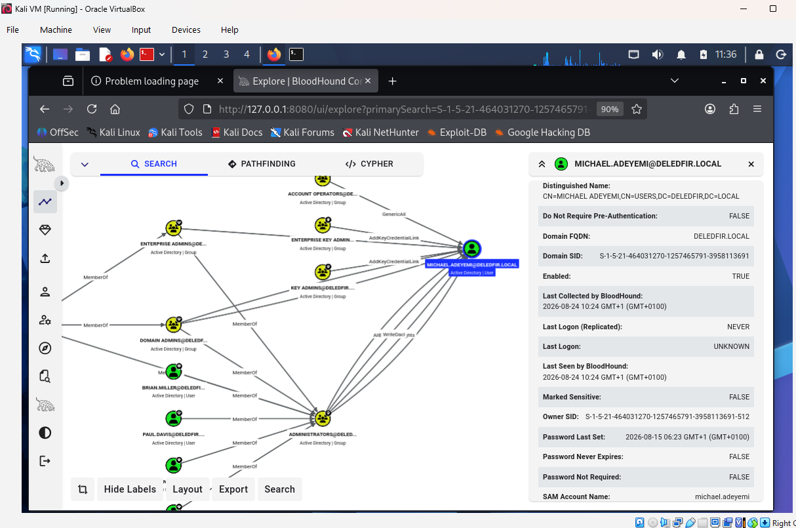

Configured Kali DNS to use DC1, collected `DeleDFIR.local` AD data with BloodHound Python, imported the results into BloodHound, and inspected Michael Adeyemi's collected user object and relationships. The exposed `description` was confirmed directly in the collected `users.json` data.

### Credential Validation

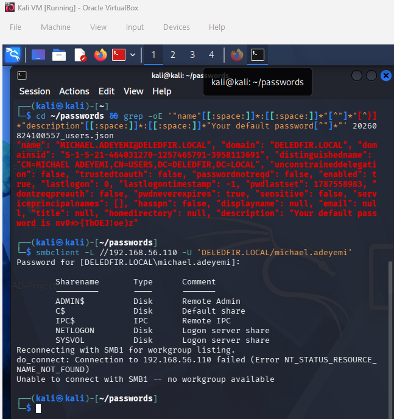

Validated the discovered credential against Michael's `DeleDFIR.local` account over SMB to DC1, confirming that the readable AD attribute contained a usable password.

### Credential Remediation

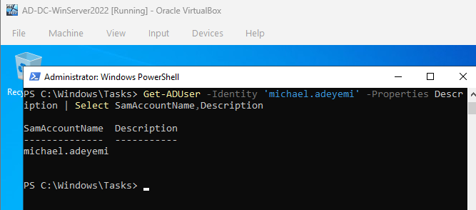

Reset Michael's password, cleared the exposed AD `description` attribute, and verified that the credential was no longer present.

## Challenges & Troubleshooting
AD automation generated random passwords when accounts were recreated, invalidating known credentials; resolved by verifying account state and retrieving the current lab credential before rerunning BloodHound.
`BloodHound` did not display the exposed description directly in the user panel, so users.json was searched to identify the exposed credential, which was then successfully validated through SMB authentication within the lab.

## Summary
- **Investigation Findings:** BloodHound, `users.json`, and SMB authentication confirmed that Michael Adeyemi's AD `description` field exposed a usable password that authenticated against DC1.
- **Security Decision:** The exposed credential was treated as compromised, requiring a password reset and removal of the password-bearing `description` attribute.
- **Validation:** `Get-ADUser` verified that the `description` field was cleared after remediation.

## Operational Impact
Helps security teams identify and remediate exposed Active Directory credentials before they can be reused for unauthorized access or lateral movement.

---

## Part 11: NTLM vs Kerberos — Kerberoasting

### Objective
Show how a low‑privileged domain user can abuse an exposed Kerberos SPN to request a service ticket and enable offline password cracking, underscoring the risk of weak service‑account credentials.

### Skills
- **Active Directory Security:** Provisioned the dedicated `HTTP_service` account, registered its HTTP SPN, and verified its AD configuration.
- **Identity & Access Management:** Assessed `HTTP_service` group membership, `AdminCount`, delegation status, and assigned privileges after credential recovery.
- **Kerberos Authentication:** Used Impacket `GetUserSPNs` to enumerate the service SPN and request a Kerberos TGS-REP using a low-privileged domain account.
- **Kerberoasting & Credential Attack Analysis:** Captured the `$krb5tgs$23$` hash, cracked it offline with Hashcat using a controlled wordlist, and recovered the service-account password.
- **PowerShell Automation:** Modified `gen-ad.ps1` to provision Kerberoastable accounts, register/remove SPNs, and preserve existing account-management behavior.
- **Networking:** Configured Kali DNS to DC1 and used the DC1 IP for authenticated Kerberos/SPN requests from the Host-Only lab network.
- **Security Validation:** Verified SPN registration, TGS-REP capture, offline password recovery, and the resulting service-account privilege level.

### Tools
- **PowerShell:** Modified and executed `gen-ad.ps1` to provision `HTTP_service`, register/remove its SPN, manage its password, and validate AD configuration.
- **Active Directory:** Hosted the `HTTP_service` account, HTTP SPN, group memberships, and privilege configuration used in the Kerberoasting scenario.
- **Kali Linux:** Provided the attack workstation for Kerberos enumeration, TGS-REP capture, and offline credential analysis.
- **Impacket GetUserSPNs:** Enumerated the `HTTP_service` SPN and requested its Kerberos TGS-REP using a low-privileged domain account.
- **Hashcat:** Cracked the captured `$krb5tgs$23$` TGS-REP hash using a controlled lab wordlist.
- **VirtualBox:** Provided the isolated Host-Only network connecting Kali, DC1, and WS01.

### Steps

[View PowerShell AD Automation – Part 11](./PowerShell-AD-Auto-10-11/)

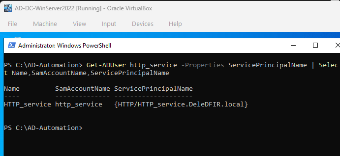

- Configured the AD provisioning workflow to create the dedicated `HTTP_service` account and automatically register its `HTTP/HTTP_service.DeleDFIR.local` SPN.

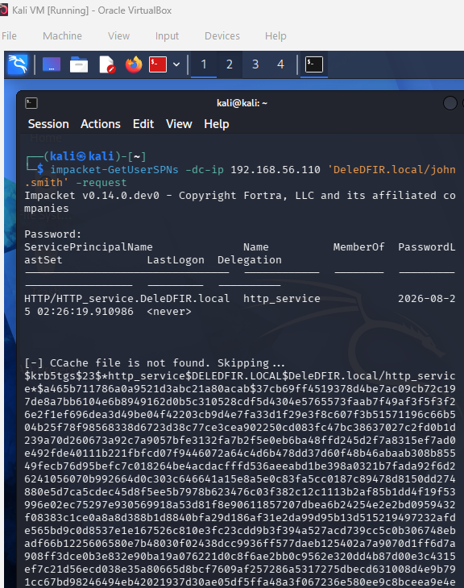

- Used a low-privileged domain account with Impacket `GetUserSPNs` to enumerate the `HTTP_service` SPN and request its Kerberos TGS-REP hash for offline analysis.

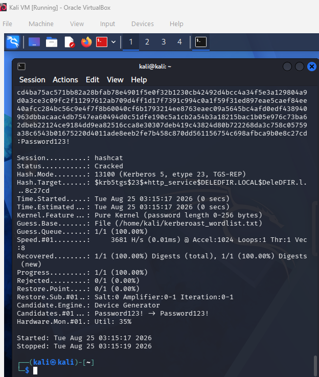

- Used Hashcat with a controlled wordlist to crack the captured Kerberos TGS-REP hash and recover the deliberately weak `HTTP_service` password.
- Assessed the recovered service account's group membership, `AdminCount`, delegation status, and assigned privileges, confirming that it was limited to `Domain Users` with no privileged group membership.

### Summary
- **Investigation Findings:** Evidence from Active Directory, Impacket, and Hashcat confirmed that the low-privileged `john.smith` account could request a TGS-REP for `HTTP_service`, whose weak password was subsequently recovered offline.
- **Security Decision:** The service account was assessed against least-privilege principles and found to be limited to `Domain Users`, so remediation focused on eliminating weak service-account credentials and unnecessary SPNs rather than treating the account as privileged.
- **Validation:** The workflow was validated end-to-end by confirming the SPN, capturing a `$krb5tgs$23$` hash, successfully cracking it, and verifying that `HTTP_service` had no privileged group membership, no `AdminCount`, and no unconstrained delegation.

### Operational Impact
The implementation demonstrates a complete identity-attack path that defenders can detect and mitigate through strong, unique service-account credentials, least-privilege access, and removal of unnecessary SPNs, reducing exposure to credential compromise and unauthorized resource access.